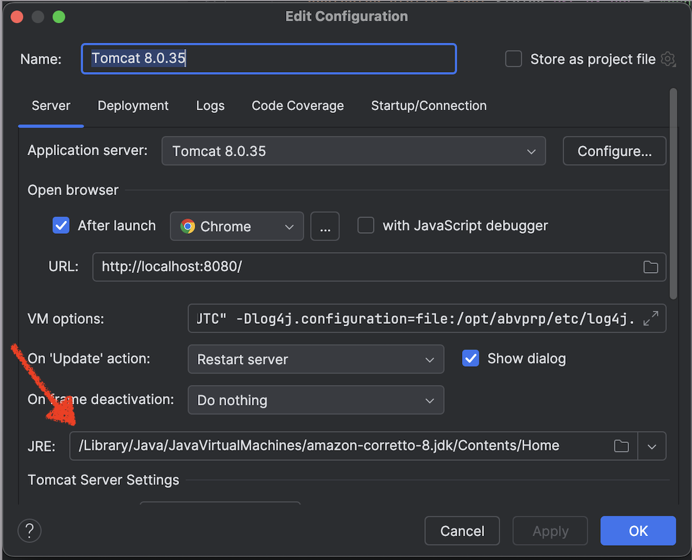
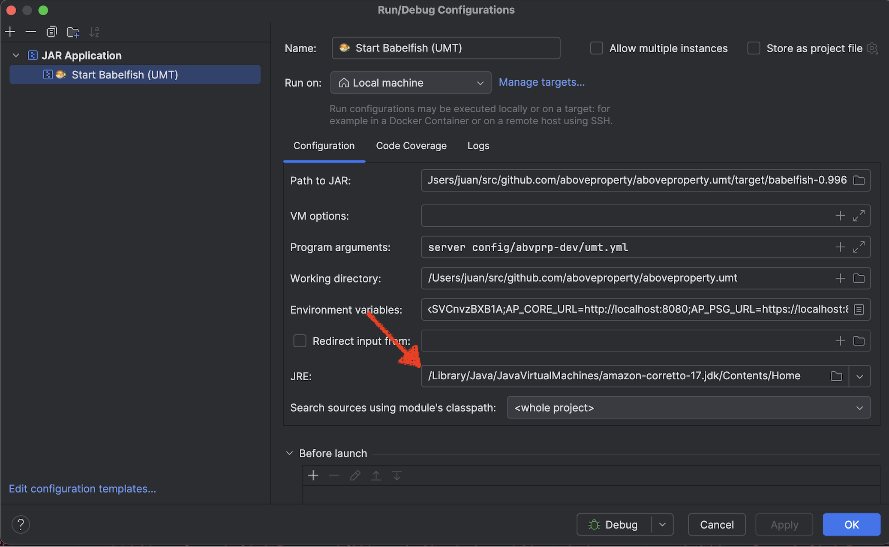

# How to download UMT certificate and install it in local JREs

When running UMT (Babelfish) and APCore locally, each Java Runtime Environment (JRE) must trust the HTTPS certificate served at `https://localhost:8580`.  
This guide explains how to extract the certificate and install it into the Java truststores that APCore and UMT use.

---

## 1. Go to your home folder

```bash
cd ~
pwd
```

Expected something like this:

```
/Users/juan
```

---

## 2. Ensure UMT is running at `https://localhost:8580`

Test the ping endpoint:

```bash
curl -k https://localhost:8580/umt/v1/ping
```

Expected response:

```json
{
  "message": "OK",
  "version": "20b52fd",
  "code": "APS200",
  "responseTimeMS": "0"
}
```

---

## 3. Download the UMT certificate

This extracts the certificate from UMT and saves it as `umt-local.pem`:

```bash
echo -n | openssl s_client -connect localhost:8580 -servername localhost   2>/dev/null | sed -ne '/-BEGIN CERTIFICATE-/,/-END CERTIFICATE-/p'   > umt-local.pem
```

Verify:

```bash
cat umt-local.pem
```

---

## 4. Check installed Java versions (jenv)

```bash
jenv versions
```

Example:

```
  system
  1.8
  1.8.0.462
  11
  11.0
  11.0.28
  17
  17.0
  17.0.16
  corretto64-1.8.0.462
  corretto64-11.0.28
  corretto64-17.0.16
```

---

## 5. Identify the JRE used by APCore (Java 17)

In IntelliJ → Tomcat Configuration → JRE  
    


---

## 6. Identify the JRE used by UMT (Java 8)

In IntelliJ → Run/Debug Configurations → JAR Application: JRE  
    


⚠️ Each JRE has its own `cacerts` truststore — you must install the certificate in each one separately.

---

## 7. Import the certificate into UMT’s JRE (Java 8)

```bash
jenv shell corretto64-1.8.0.462
realpath $JAVA_HOME

sudo $JAVA_HOME/bin/keytool -importcert   -keystore "$JAVA_HOME/jre/lib/security/cacerts"   -storepass changeit   -alias umt-local   -file ~/umt-local.pem
```

📌 Java 8 uses: **`jre/lib/security/cacerts`**

---

## 8. Import the certificate into APCore’s JRE (Java 17)

```bash
jenv shell corretto64-17.0.16
realpath $JAVA_HOME

sudo $JAVA_HOME/bin/keytool -importcert   -keystore "$JAVA_HOME/lib/security/cacerts"   -storepass changeit   -alias umt-local   -file ~/umt-local.pem
```

📌 Java 17 uses: **`lib/security/cacerts`**

---

## ✔️ Done!

Now both UMT and APCore can communicate over HTTPS without:

```
SSLHandshakeException: PKIX path validation failed
CertPathValidatorException: signature check failed
```

Your local APS environment should now work cleanly with secure connections.
