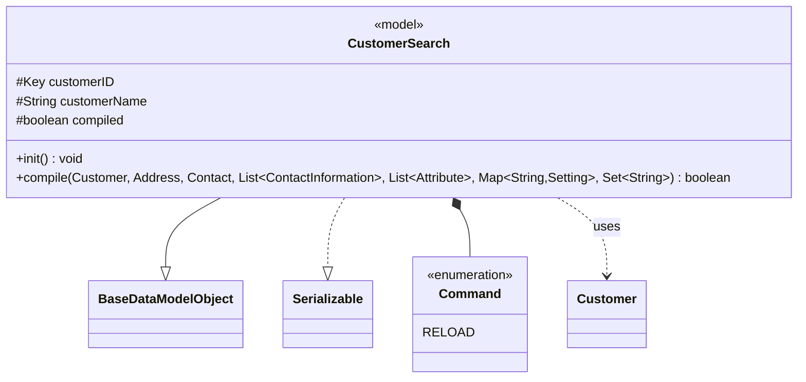

# 🧭 Mermaid Class Diagram Generator — Java

You are generating a **Mermaid `classDiagram`** from the Java source file provided in context.
Output a single `.md` file saved alongside the source file using the same base name with the suffix `.diagram.md`.

---

## 🎯 Diagram Rules

### Classes & Visibility
- Map every class, abstract class, interface, and enum in the file.
- Use Mermaid visibility prefixes: `+` public, `#` protected, `-` private, `~` package-private.
- Add stereotypes: `<<abstract>>`, `<<interface>>`, `<<enumeration>>`, `<<model>>`, `<<dao>>`.
- Inner `enum` types → separate named `class` with `<<enumeration>>` + `*--` composition from the outer class.

### Fields
- Include all declared fields with their type, using Mermaid generic syntax `~T~` for Java generics  
  (e.g. `List<String>` → `List~String~`, `Map<String,Setting>` → `Map~String,Setting~`).
- Mark `transient` fields with a note in the name (e.g. `transient~boolean~ compiled`).

### Methods
- Include public and protected methods; omit trivial getters/setters unless they have domain significance.
- For abstract methods append `*` to the return type (e.g. `+search(String) List~Result~*`).
- For static members append `$` (e.g. `+CONSTANT$ String`).

### Relationships — use the correct Mermaid arrow for each case
| Java                   | Mermaid      | Arrow    |
|------------------------|--------------|----------|
| `extends`              | Inheritance  | `--|>`   |
| `implements`           | Realization  | `..|>`   |
| inner / nested type    | Composition  | `*--`    |
| field reference        | Association  | `-->`    |
| method param / return  | Dependency   | `..>`    |
| `@Inject` provider     | Dependency   | `..>`    |

- Add a short label on dependency arrows where it adds clarity (e.g. `..> CustomerDAO : injects`).

### Generics
- Use `~T~` not `<T>` everywhere — Mermaid requires tilde syntax.

### Syntax Safety
- **Never** use `+--` (unsupported). Use `*--` for composition / inner classes.
- One relationship per line; no combined / comma-separated lines.
- Class names must be alphanumeric + underscore only (no dots, slashes, or spaces).

---

## 📤 Output Format

Save the diagram to a new `.md` file next to the source file:

```
// filepath: <same directory as source>/<ClassName>.diagram.md
# <ClassName> Class Diagram

```mermaid
classDiagram
    ...
```
```

Do **not** include any prose, explanation, or code fences outside that single file block.

---

## 📌 Example Snippet

