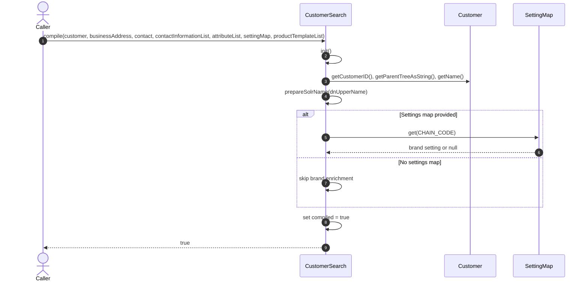

# 🧭 Mermaid Sequence Diagram Generator — Java

You are generating a Mermaid `sequenceDiagram` from the Java source file provided in context.
Model the dominant call flow in the file using only the behavior visible in that file.
Output a single `.md` file saved alongside the source file using the same base name with the suffix `.sequence.md`.

---

## 🎯 Goal

Convert the active Java file into a readable sequence that shows how the main method, model, DAO, task, or service interacts with collaborators over time.

Examples:
- Model classes: primary compile/build/transform method and its helper calls
- DAO classes: query orchestration, dependent DAO/cache calls, transformation, return
- Task/resource classes: request intake, validation, branching, controller/DAO calls, response
- Service/controller classes: input, rule evaluation, external calls, persistence, result

---

## 🧩 Sequence Rules

### Source interpretation
- Use only method calls, control flow, comments, and direct collaborators visible in the file.
- Prefer the dominant end-to-end flow over attempting to represent every method.
- If one public method is clearly central, base the diagram on that method.
- If the file contains many endpoints or helpers, choose the most representative workflow.
- Include major branches using `alt`, `else`, `opt`, and loops using `loop` where they materially affect understanding.

### Participants
- Keep participant names concise and Mermaid-safe.
- Use aliases where needed, for example:
  - `participant CS as CustomerSearch`
  - `participant Cust as Customer`
  - `participant DAO as ReservationDAO`
- Use `actor Caller` when the sequence begins from an external invoker.
- Do not invent systems or services not implied by the code.

### Message design
- Prefer meaningful call summaries over raw implementation detail.
- Use method names when they are central to the flow.
- Collapse repetitive getter calls into grouped lines when that improves readability.
- Show self-calls for important internal helpers.
- Show return values only when they matter to branching or completion.

### Branching and loops
- Use `alt` for mutually exclusive branches.
- Use `opt` for optional enrichments that do not require a full alternative branch.
- Use `loop` for collection iteration or repeated record processing.
- Keep branches focused on behavior, not every null check unless it changes the outcome.

### Syntax safety
- Use valid Mermaid `sequenceDiagram` syntax only.
- Do not mix `journey`, `classDiagram`, or `flowchart` syntax into the output.
- Use `autonumber` unless it would make the diagram misleading.
- Keep each participant declaration and message on its own line.
- Avoid unsupported Mermaid constructs.

---

## 📤 Output Format

Save the diagram to a new `.md` file next to the source file:

```
// filepath: <same directory as source>/<ClassName>.sequence.md
# <ClassName> Sequence Diagram

```mermaid
sequenceDiagram
    autonumber
    actor Caller
    participant X as <ClassName>
    ...
```
```

Do not include any prose, explanation, or code fences outside that single file block.

---

## 📌 Example Snippet

