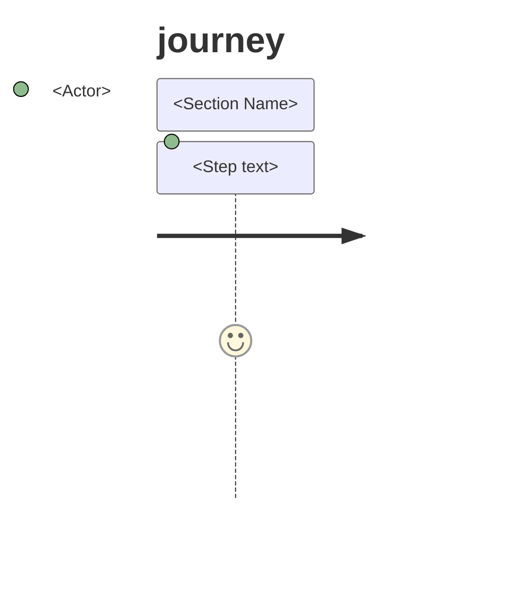
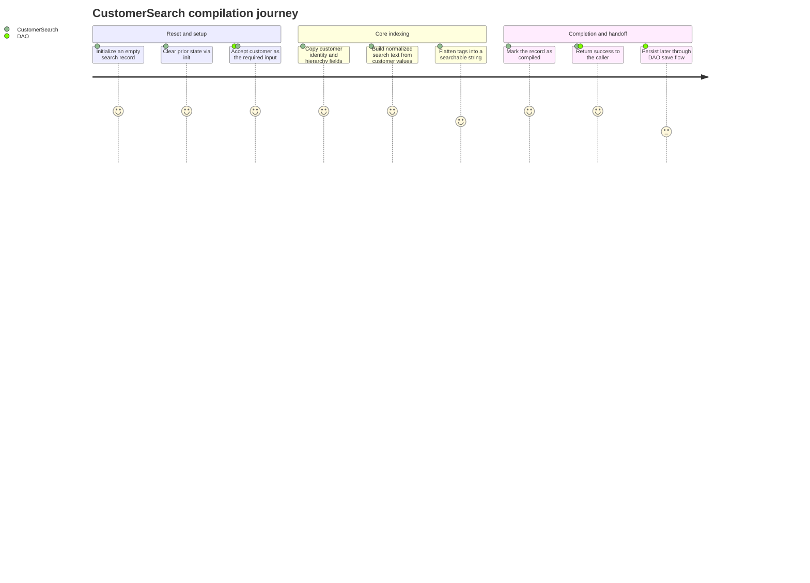

# 🧭 Mermaid User Journey Generator — Java

You are generating a Mermaid `journey` diagram from the Java source file provided in context.
Interpret the file as a lifecycle or operational journey, not a UI screen flow.
Output a single `.md` file saved alongside the source file using the same base name with the suffix `.user-journey.md`.

---

## 🎯 Goal

Convert the active Java file into a readable journey that explains how the main actor, model, DAO, task, or service progresses through its primary flow.

Examples:
- Model classes: initialization, enrichment, validation, serialization, handoff
- DAO classes: input, query/build, lookup, transformation, persistence, return
- Task/resource classes: request, validation, branching, orchestration, response
- Service/controller classes: intake, dependency calls, business rules, side effects, result

---

## 🧩 Journey Rules

### Source interpretation
- Use only behavior visible in the file and its method names, comments, and direct collaborators.
- Prefer the dominant lifecycle in the file over exhaustively listing every method.
- Group related steps into 4 to 7 sections.
- Each section should contain 3 to 6 steps when possible.
- If the file has one clear primary method, center the journey around that method.
- If the file is broad and administrative, focus on the most representative end-to-end flow.

### Actors
- Use concise actor names such as `CustomerSearch`, `DAO`, `Task`, `Controller`, `Customer`, `Address`, `Contact`.
- Include 1 to 3 actors per step.
- Do not invent external actors that are not implied by the code.

### Scoring
- Mermaid journey syntax requires a score from 1 to 5.
- Use the score to reflect operational confidence or smoothness of the step:
  - `5` straightforward or required core path
  - `4` normal enrichment or expected branch
  - `3` optional or conditional path
  - `2` fallback, defensive handling, or recoverable issue
  - `1` failure or terminal error path

### Step writing
- Write steps as short action phrases.
- Prefer verbs first: `Initialize empty record`, `Copy customer identity`, `Normalize phone value`.
- Keep each step on one line.
- Avoid code syntax in the step text unless a method name is especially important.
- Mention fallback behavior when it materially affects the flow.

### Syntax safety
- Use valid Mermaid `journey` syntax only.
- Do not mix `flowchart`, `sequenceDiagram`, or `classDiagram` syntax into the output.
- Every step line must follow this format:

  `Step text: score: Actor, Actor`

- Keep actor names simple and Mermaid-safe.

---

## 📤 Output Format

Save the diagram to a new `.md` file next to the source file:

```
// filepath: <same directory as source>/<ClassName>.user-journey.md
# <ClassName> User Journey


```

Do not include any prose, explanation, or code fences outside that single file block.

---

## 📌 Example Snippet

