# Cassandra Schema Diagrams

Generated from: `aboveproperty.devops/grafana-prometheus-docker-dev/cassandra-docker/files/schema`

- Tables: **185**
- Inferred relationships: **453**
- Diagrams: **18** (max **25** tables each)

## Cross-Diagram Links

Relationships omitted from Mermaid blocks because source and destination tables are in different diagrams:

### Diagram Relationship Overview

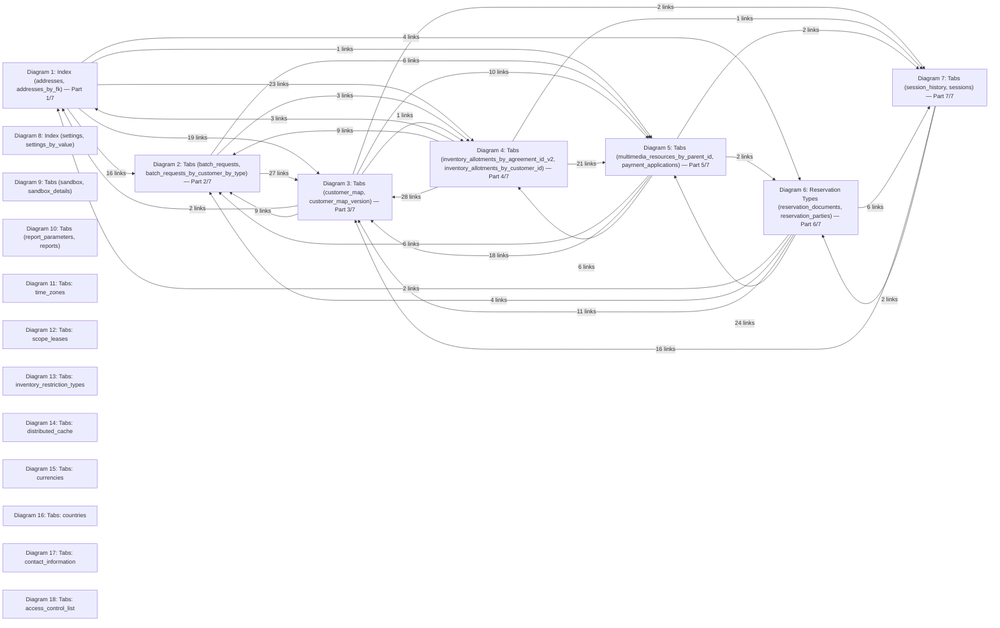

### Detailed Cross-Diagram Links

- `addresses` (Diagram 1) -> `customers` (Diagram 3) via `customer_id`
- `addresses_by_fk` (Diagram 1) -> `customers` (Diagram 3) via `customer_id`
- `agreement_prices_v2` (Diagram 1) -> `customers` (Diagram 3) via `customer_id`
- `agreement_prices_v2` (Diagram 1) -> `prices` (Diagram 5) via `price_id`
- `agreements` (Diagram 1) -> `customers` (Diagram 3) via `customer_id`
- `agreements` (Diagram 1) -> `multimedia_resources` (Diagram 4) via `multimedia_resource_id`
- `agreements_by_access_key` (Diagram 1) -> `customers` (Diagram 3) via `customer_id`
- `agreements_by_access_key` (Diagram 1) -> `multimedia_resources` (Diagram 4) via `multimedia_resource_id`
- `alerts` (Diagram 1) -> `channel_parameters` (Diagram 2) via `channel_parameter_id`
- `alerts` (Diagram 1) -> `channels` (Diagram 2) via `channel_id`
- `alerts` (Diagram 1) -> `contacts` (Diagram 2) via `contact_id`
- `alerts` (Diagram 1) -> `customers` (Diagram 3) via `customer_id`
- `alerts` (Diagram 1) -> `marketing_campaigns` (Diagram 4) via `marketing_campaign_id`
- `alerts` (Diagram 1) -> `marketing_media` (Diagram 4) via `marketing_media_id`
- `alerts` (Diagram 1) -> `marketing_media_calendar` (Diagram 4) via `marketing_media_calendar_id`
- `alerts` (Diagram 1) -> `mmedia_calendar_impressions` (Diagram 4) via `mmedia_calendar_impression_id`
- `alerts` (Diagram 1) -> `rules` (Diagram 6) via `rule_id`
- `alerts_by_customer` (Diagram 1) -> `channel_parameters` (Diagram 2) via `channel_parameter_id`
- `alerts_by_customer` (Diagram 1) -> `channels` (Diagram 2) via `channel_id`
- `alerts_by_customer` (Diagram 1) -> `contacts` (Diagram 2) via `contact_id`
- `alerts_by_customer` (Diagram 1) -> `customers` (Diagram 3) via `customer_id`
- `alerts_by_customer` (Diagram 1) -> `marketing_campaigns` (Diagram 4) via `marketing_campaign_id`
- `alerts_by_customer` (Diagram 1) -> `marketing_media` (Diagram 4) via `marketing_media_id`
- `alerts_by_customer` (Diagram 1) -> `marketing_media_calendar` (Diagram 4) via `marketing_media_calendar_id`
- `alerts_by_customer` (Diagram 1) -> `mmedia_calendar_impressions` (Diagram 4) via `mmedia_calendar_impression_id`
- `alerts_by_customer` (Diagram 1) -> `rules` (Diagram 6) via `rule_id`
- `alerts_by_customer_by_fk` (Diagram 1) -> `customers` (Diagram 3) via `customer_id`
- `alerts_by_customer_by_type` (Diagram 1) -> `customers` (Diagram 3) via `customer_id`
- `alerts_by_marketing_media_id` (Diagram 1) -> `channel_parameters` (Diagram 2) via `channel_parameter_id`
- `alerts_by_marketing_media_id` (Diagram 1) -> `channels` (Diagram 2) via `channel_id`
- `alerts_by_marketing_media_id` (Diagram 1) -> `contacts` (Diagram 2) via `contact_id`
- `alerts_by_marketing_media_id` (Diagram 1) -> `customers` (Diagram 3) via `customer_id`
- `alerts_by_marketing_media_id` (Diagram 1) -> `marketing_campaigns` (Diagram 4) via `marketing_campaign_id`
- `alerts_by_marketing_media_id` (Diagram 1) -> `marketing_media` (Diagram 4) via `marketing_media_id`
- `alerts_by_marketing_media_id` (Diagram 1) -> `marketing_media_calendar` (Diagram 4) via `marketing_media_calendar_id`
- `alerts_by_marketing_media_id` (Diagram 1) -> `mmedia_calendar_impressions` (Diagram 4) via `mmedia_calendar_impression_id`
- `alerts_by_marketing_media_id` (Diagram 1) -> `rules` (Diagram 6) via `rule_id`
- `alerts_by_parent` (Diagram 1) -> `channel_parameters` (Diagram 2) via `channel_parameter_id`
- `alerts_by_parent` (Diagram 1) -> `channels` (Diagram 2) via `channel_id`
- `alerts_by_parent` (Diagram 1) -> `contacts` (Diagram 2) via `contact_id`
- `alerts_by_parent` (Diagram 1) -> `customers` (Diagram 3) via `customer_id`
- `alerts_by_parent` (Diagram 1) -> `marketing_campaigns` (Diagram 4) via `marketing_campaign_id`
- `alerts_by_parent` (Diagram 1) -> `marketing_media` (Diagram 4) via `marketing_media_id`
- `alerts_by_parent` (Diagram 1) -> `marketing_media_calendar` (Diagram 4) via `marketing_media_calendar_id`
- `alerts_by_parent` (Diagram 1) -> `mmedia_calendar_impressions` (Diagram 4) via `mmedia_calendar_impression_id`
- `alerts_by_parent` (Diagram 1) -> `rules` (Diagram 6) via `rule_id`
- `alerts_by_response_value` (Diagram 1) -> `channels` (Diagram 2) via `channel_id`
- `alerts_by_response_value` (Diagram 1) -> `customers` (Diagram 3) via `customer_id`
- `alerts_pending_task` (Diagram 1) -> `customers` (Diagram 3) via `customer_id`
- `analytic_entries_v2` (Diagram 1) -> `channels` (Diagram 2) via `channel_id`
- `analytic_entries_v2` (Diagram 1) -> `customers` (Diagram 3) via `customer_id`
- `analytic_entries_v2` (Diagram 1) -> `marketing_media` (Diagram 4) via `marketing_media_id`
- `analytic_entries_v2` (Diagram 1) -> `marketing_media_calendar` (Diagram 4) via `marketing_media_calendar_id`
- `analytic_entry_calendar` (Diagram 1) -> `channels` (Diagram 2) via `channel_id`
- `analytic_entry_calendar` (Diagram 1) -> `customers` (Diagram 3) via `customer_id`
- `attribute_type_values_v2` (Diagram 1) -> `multimedia_resources` (Diagram 4) via `multimedia_resource_id`
- `attribute_types` (Diagram 1) -> `customers` (Diagram 3) via `customer_id`
- `attributes` (Diagram 1) -> `customers` (Diagram 3) via `customer_id`
- `attributes` (Diagram 1) -> `multimedia_resources` (Diagram 4) via `multimedia_resource_id`
- `attributes_by_fk_reference` (Diagram 1) -> `customers` (Diagram 3) via `customer_id`
- `attributes_by_fk_reference` (Diagram 1) -> `multimedia_resources` (Diagram 4) via `multimedia_resource_id`
- `audits_v2` (Diagram 1) -> `customers` (Diagram 3) via `customer_id`
- `batch_request_parameters` (Diagram 1) -> `batch_requests` (Diagram 2) via `batch_request_id`
- `batch_requests` (Diagram 2) -> `customers` (Diagram 3) via `customer_id`
- `batch_requests_by_customer_by_type` (Diagram 2) -> `customers` (Diagram 3) via `customer_id`
- `change_calendar` (Diagram 2) -> `customers` (Diagram 3) via `customer_id`
- `change_calendar` (Diagram 2) -> `inventory_allotments` (Diagram 3) via `inventory_allotment_id`
- `change_calendar` (Diagram 2) -> `prices` (Diagram 5) via `price_id`
- `change_calendar` (Diagram 2) -> `products` (Diagram 5) via `product_id`
- `change_requests` (Diagram 2) -> `customers` (Diagram 3) via `customer_id`
- `change_requests` (Diagram 2) -> `inventory_allotments` (Diagram 3) via `inventory_allotment_id`
- `change_requests` (Diagram 2) -> `prices` (Diagram 5) via `price_id`
- `change_requests` (Diagram 2) -> `products` (Diagram 5) via `product_id`
- `change_requests_by_change_timestamp` (Diagram 2) -> `customers` (Diagram 3) via `customer_id`
- `change_requests_by_change_timestamp` (Diagram 2) -> `inventory_allotments` (Diagram 3) via `inventory_allotment_id`
- `change_requests_by_change_timestamp` (Diagram 2) -> `prices` (Diagram 5) via `price_id`
- `change_requests_by_change_timestamp` (Diagram 2) -> `products` (Diagram 5) via `product_id`
- `channel_contacts` (Diagram 2) -> `customers` (Diagram 3) via `customer_id`
- `channel_contacts` (Diagram 2) -> `marketing_campaigns` (Diagram 4) via `marketing_campaign_id`
- `channel_content` (Diagram 2) -> `customers` (Diagram 3) via `customer_id`
- `channel_content_by_channel_content_id` (Diagram 2) -> `customers` (Diagram 3) via `customer_id`
- `channel_parameters` (Diagram 2) -> `customers` (Diagram 3) via `customer_id`
- `channel_parameters_by_channel_fk` (Diagram 2) -> `customers` (Diagram 3) via `customer_id`
- `channel_parameters_by_channel_fk_reference` (Diagram 2) -> `customers` (Diagram 3) via `customer_id`
- `channel_parameters_by_channel_parameter_name` (Diagram 2) -> `customers` (Diagram 3) via `customer_id`
- `channels` (Diagram 2) -> `customers` (Diagram 3) via `customer_id`
- `channels_by_channel_code` (Diagram 2) -> `customers` (Diagram 3) via `customer_id`
- `channels_by_parent_id` (Diagram 2) -> `customers` (Diagram 3) via `customer_id`
- `codes` (Diagram 2) -> `customers` (Diagram 3) via `customer_id`
- `codes_by_code_type` (Diagram 2) -> `customers` (Diagram 3) via `customer_id`
- `comments` (Diagram 2) -> `customers` (Diagram 3) via `customer_id`
- `contacts` (Diagram 2) -> `customers` (Diagram 3) via `customer_id`
- `contacts` (Diagram 2) -> `marketing_campaigns` (Diagram 4) via `marketing_campaign_id`
- `contacts_by_customer_id` (Diagram 2) -> `customers` (Diagram 3) via `customer_id`
- `contacts_by_customer_id` (Diagram 2) -> `marketing_campaigns` (Diagram 4) via `marketing_campaign_id`
- `currency_exchange_rates` (Diagram 2) -> `customers` (Diagram 3) via `customer_id`
- `customer_credit_cards` (Diagram 2) -> `customers` (Diagram 3) via `customer_id`
- `customer_domains` (Diagram 2) -> `customers` (Diagram 3) via `customer_id`
- `customer_languages` (Diagram 2) -> `customers` (Diagram 3) via `customer_id`
- `customer_media_subscriptions` (Diagram 3) -> `channels` (Diagram 2) via `channel_id`
- `customer_media_subscriptions` (Diagram 3) -> `marketing_media` (Diagram 4) via `marketing_media_id`
- `customer_subscriptions` (Diagram 3) -> `subscription_pricing` (Diagram 7) via `subscription_pricing_id`
- `customer_subscriptions` (Diagram 3) -> `subscriptions` (Diagram 7) via `subscription_id`
- `data_load_rejects` (Diagram 3) -> `alerts` (Diagram 1) via `alert_id`
- `delivery_queue` (Diagram 3) -> `channels` (Diagram 2) via `channel_id`
- `delivery_queue` (Diagram 3) -> `contacts` (Diagram 2) via `contact_id`
- `general_ledger_trx` (Diagram 3) -> `batch_requests` (Diagram 2) via `batch_request_id`
- `general_ledger_trx_by_batch_request` (Diagram 3) -> `batch_requests` (Diagram 2) via `batch_request_id`
- `inv_restriction_requests` (Diagram 3) -> `channels` (Diagram 2) via `channel_id`
- `inv_restriction_requests` (Diagram 3) -> `prices` (Diagram 5) via `price_id`
- `inv_restriction_requests` (Diagram 3) -> `products` (Diagram 5) via `product_id`
- `inventory_allotment_calendar` (Diagram 3) -> `channels` (Diagram 2) via `channel_id`
- `inventory_allotment_calendar` (Diagram 3) -> `prices` (Diagram 5) via `price_id`
- `inventory_allotment_calendar` (Diagram 3) -> `products` (Diagram 5) via `product_id`
- `inventory_allotment_calendar_by_customer_id` (Diagram 3) -> `channels` (Diagram 2) via `channel_id`
- `inventory_allotment_calendar_by_customer_id` (Diagram 3) -> `prices` (Diagram 5) via `price_id`
- `inventory_allotment_calendar_by_customer_id` (Diagram 3) -> `products` (Diagram 5) via `product_id`
- `inventory_allotment_releases` (Diagram 3) -> `prices` (Diagram 5) via `price_id`
- `inventory_allotment_releases` (Diagram 3) -> `products` (Diagram 5) via `product_id`
- `inventory_allotments` (Diagram 3) -> `agreements` (Diagram 1) via `agreement_id`
- `inventory_allotments` (Diagram 3) -> `channels` (Diagram 2) via `channel_id`
- `inventory_allotments` (Diagram 3) -> `prices` (Diagram 5) via `price_id`
- `inventory_allotments` (Diagram 3) -> `products` (Diagram 5) via `product_id`
- `inventory_allotments_by_agreement_id_v2` (Diagram 4) -> `agreements` (Diagram 1) via `agreement_id`
- `inventory_allotments_by_agreement_id_v2` (Diagram 4) -> `channels` (Diagram 2) via `channel_id`
- `inventory_allotments_by_agreement_id_v2` (Diagram 4) -> `customers` (Diagram 3) via `customer_id`
- `inventory_allotments_by_agreement_id_v2` (Diagram 4) -> `inventory_allotments` (Diagram 3) via `inventory_allotment_id`
- `inventory_allotments_by_agreement_id_v2` (Diagram 4) -> `prices` (Diagram 5) via `price_id`
- `inventory_allotments_by_agreement_id_v2` (Diagram 4) -> `products` (Diagram 5) via `product_id`
- `inventory_allotments_by_customer_id` (Diagram 4) -> `customers` (Diagram 3) via `customer_id`
- `inventory_allotments_by_customer_id` (Diagram 4) -> `inventory_allotments` (Diagram 3) via `inventory_allotment_id`
- `inventory_consumed_map` (Diagram 4) -> `channels` (Diagram 2) via `channel_id`
- `inventory_consumed_map` (Diagram 4) -> `customers` (Diagram 3) via `customer_id`
- `inventory_consumed_map` (Diagram 4) -> `inventory_allotments` (Diagram 3) via `inventory_allotment_id`
- `inventory_consumed_map` (Diagram 4) -> `prices` (Diagram 5) via `price_id`
- `inventory_consumed_map` (Diagram 4) -> `products` (Diagram 5) via `product_id`
- `inventory_map` (Diagram 4) -> `channels` (Diagram 2) via `channel_id`
- `inventory_map` (Diagram 4) -> `customers` (Diagram 3) via `customer_id`
- `inventory_map` (Diagram 4) -> `inventory_allotments` (Diagram 3) via `inventory_allotment_id`
- `inventory_map` (Diagram 4) -> `prices` (Diagram 5) via `price_id`
- `inventory_map` (Diagram 4) -> `products` (Diagram 5) via `product_id`
- `inventory_requests` (Diagram 4) -> `channels` (Diagram 2) via `channel_id`
- `inventory_requests` (Diagram 4) -> `customers` (Diagram 3) via `customer_id`
- `inventory_requests` (Diagram 4) -> `inventory_allotments` (Diagram 3) via `inventory_allotment_id`
- `inventory_requests` (Diagram 4) -> `prices` (Diagram 5) via `price_id`
- `inventory_requests` (Diagram 4) -> `products` (Diagram 5) via `product_id`
- `inventory_types` (Diagram 4) -> `customers` (Diagram 3) via `customer_id`
- `invoice_lines` (Diagram 4) -> `customer_subscriptions` (Diagram 3) via `customer_subscription_id`
- `invoice_lines` (Diagram 4) -> `customers` (Diagram 3) via `customer_id`
- `invoice_lines` (Diagram 4) -> `prices` (Diagram 5) via `price_id`
- `invoice_lines` (Diagram 4) -> `product_templates` (Diagram 5) via `product_template_id`
- `invoice_lines` (Diagram 4) -> `products` (Diagram 5) via `product_id`
- `invoice_lines_by_billing_customer_by_date` (Diagram 4) -> `customer_subscriptions` (Diagram 3) via `customer_subscription_id`
- `invoice_lines_by_billing_customer_by_date` (Diagram 4) -> `customers` (Diagram 3) via `customer_id`
- `invoice_lines_by_billing_customer_by_date` (Diagram 4) -> `prices` (Diagram 5) via `price_id`
- `invoice_lines_by_billing_customer_by_date` (Diagram 4) -> `product_templates` (Diagram 5) via `product_template_id`
- `invoice_lines_by_billing_customer_by_date` (Diagram 4) -> `products` (Diagram 5) via `product_id`
- `invoice_routing_templates` (Diagram 4) -> `general_ledger_accounts` (Diagram 3) via `general_ledger_account_id`
- `invoice_routing_templates` (Diagram 4) -> `prices` (Diagram 5) via `price_id`
- `invoice_routing_templates` (Diagram 4) -> `product_templates` (Diagram 5) via `product_template_id`
- `invoice_routing_templates` (Diagram 4) -> `products` (Diagram 5) via `product_id`
- `invoices` (Diagram 4) -> `customers` (Diagram 3) via `customer_id`
- `marketing_campaign_contacts` (Diagram 4) -> `alerts` (Diagram 1) via `alert_id`
- `marketing_campaign_contacts` (Diagram 4) -> `customers` (Diagram 3) via `customer_id`
- `marketing_campaign_filters` (Diagram 4) -> `customers` (Diagram 3) via `customer_id`
- `marketing_campaign_responses` (Diagram 4) -> `alerts` (Diagram 1) via `alert_id`
- `marketing_campaign_responses` (Diagram 4) -> `customers` (Diagram 3) via `customer_id`
- `marketing_campaigns` (Diagram 4) -> `customers` (Diagram 3) via `customer_id`
- `marketing_media` (Diagram 4) -> `customers` (Diagram 3) via `customer_id`
- `marketing_media_by_customer_id` (Diagram 4) -> `customers` (Diagram 3) via `customer_id`
- `marketing_media_by_parent_id` (Diagram 4) -> `customers` (Diagram 3) via `customer_id`
- `marketing_media_calendar` (Diagram 4) -> `channels` (Diagram 2) via `channel_id`
- `marketing_media_calendar` (Diagram 4) -> `customers` (Diagram 3) via `customer_id`
- `marketing_media_calendar` (Diagram 4) -> `programs` (Diagram 5) via `program_id`
- `message_rejects` (Diagram 4) -> `channels` (Diagram 2) via `channel_id`
- `message_rejects` (Diagram 4) -> `customers` (Diagram 3) via `customer_id`
- `mkt_media_calendar_requests` (Diagram 4) -> `channels` (Diagram 2) via `channel_id`
- `mkt_media_calendar_requests` (Diagram 4) -> `customers` (Diagram 3) via `customer_id`
- `mkt_media_calendar_requests` (Diagram 4) -> `programs` (Diagram 5) via `program_id`
- `mmedia_cal_impression_totals` (Diagram 4) -> `channels` (Diagram 2) via `channel_id`
- `mmedia_cal_impression_totals` (Diagram 4) -> `programs` (Diagram 5) via `program_id`
- `mmedia_calendar_impressions` (Diagram 4) -> `channels` (Diagram 2) via `channel_id`
- `mmedia_calendar_impressions` (Diagram 4) -> `programs` (Diagram 5) via `program_id`
- `mmedia_calendar_impressions` (Diagram 4) -> `sessions` (Diagram 7) via `session_id`
- `multimedia_resources` (Diagram 4) -> `customers` (Diagram 3) via `customer_id`
- `multimedia_resources_by_parent_id` (Diagram 5) -> `customers` (Diagram 3) via `customer_id`
- `multimedia_resources_by_parent_id` (Diagram 5) -> `multimedia_resources` (Diagram 4) via `multimedia_resource_id`
- `payment_applications` (Diagram 5) -> `invoice_lines` (Diagram 4) via `invoice_line_id`
- `payment_applications` (Diagram 5) -> `invoices` (Diagram 4) via `invoice_id`
- `payment_applications_by_invoice` (Diagram 5) -> `invoice_lines` (Diagram 4) via `invoice_line_id`
- `payment_applications_by_invoice` (Diagram 5) -> `invoices` (Diagram 4) via `invoice_id`
- `payments` (Diagram 5) -> `customers` (Diagram 3) via `customer_id`
- `payments` (Diagram 5) -> `general_ledger_accounts` (Diagram 3) via `general_ledger_account_id`
- `payments_schedule` (Diagram 5) -> `customers` (Diagram 3) via `customer_id`
- `price_adjustment_calendar` (Diagram 5) -> `channels` (Diagram 2) via `channel_id`
- `price_adjustment_calendar` (Diagram 5) -> `customers` (Diagram 3) via `customer_id`
- `price_adjustment_requests` (Diagram 5) -> `channels` (Diagram 2) via `channel_id`
- `price_adjustment_requests` (Diagram 5) -> `customers` (Diagram 3) via `customer_id`
- `price_calendar` (Diagram 5) -> `channels` (Diagram 2) via `channel_id`
- `price_calendar` (Diagram 5) -> `customers` (Diagram 3) via `customer_id`
- `price_calendar_requests` (Diagram 5) -> `channels` (Diagram 2) via `channel_id`
- `price_calendar_requests` (Diagram 5) -> `customers` (Diagram 3) via `customer_id`
- `price_credit_cards` (Diagram 5) -> `customers` (Diagram 3) via `customer_id`
- `price_map` (Diagram 5) -> `channels` (Diagram 2) via `channel_id`
- `price_map` (Diagram 5) -> `customers` (Diagram 3) via `customer_id`
- `price_products` (Diagram 5) -> `customers` (Diagram 3) via `customer_id`
- `price_products_by_price_product_id` (Diagram 5) -> `customers` (Diagram 3) via `customer_id`
- `prices` (Diagram 5) -> `customers` (Diagram 3) via `customer_id`
- `product_assemblies` (Diagram 5) -> `channels` (Diagram 2) via `channel_id`
- `product_customers` (Diagram 5) -> `customers` (Diagram 3) via `customer_id`
- `product_customers_by_product` (Diagram 5) -> `customers` (Diagram 3) via `customer_id`
- `products` (Diagram 5) -> `customers` (Diagram 3) via `customer_id`
- `products_by_customer_by_external_reference` (Diagram 5) -> `customers` (Diagram 3) via `customer_id`
- `reservation_authorizations` (Diagram 5) -> `reservations` (Diagram 6) via `reservation_id`
- `reservation_authorizations` (Diagram 5) -> `sessions` (Diagram 7) via `session_id`
- `reservation_comments` (Diagram 5) -> `customers` (Diagram 3) via `customer_id`
- `reservation_comments` (Diagram 5) -> `multimedia_resources` (Diagram 4) via `multimedia_resource_id`
- `reservation_comments` (Diagram 5) -> `reservations` (Diagram 6) via `reservation_id`
- `reservation_comments` (Diagram 5) -> `sessions` (Diagram 7) via `session_id`
- `reservation_documents` (Diagram 6) -> `sessions` (Diagram 7) via `session_id`
- `reservation_parties` (Diagram 6) -> `contacts` (Diagram 2) via `contact_id`
- `reservation_parties` (Diagram 6) -> `customers` (Diagram 3) via `customer_id`
- `reservation_parties` (Diagram 6) -> `sessions` (Diagram 7) via `session_id`
- `reservation_product_calendar_by_customer_by_date` (Diagram 6) -> `agreements` (Diagram 1) via `agreement_id`
- `reservation_product_calendar_by_customer_by_date` (Diagram 6) -> `customers` (Diagram 3) via `customer_id`
- `reservation_product_calendar_by_customer_by_date` (Diagram 6) -> `inventory_allotments` (Diagram 3) via `inventory_allotment_id`
- `reservation_product_calendar_by_customer_by_date` (Diagram 6) -> `prices` (Diagram 5) via `price_id`
- `reservation_product_calendar_by_customer_by_date` (Diagram 6) -> `product_templates` (Diagram 5) via `product_template_id`
- `reservation_product_calendar_by_customer_by_date` (Diagram 6) -> `products` (Diagram 5) via `product_id`
- `reservation_product_calendar_by_customer_by_date` (Diagram 6) -> `sessions` (Diagram 7) via `session_id`
- `reservations` (Diagram 6) -> `addresses` (Diagram 1) via `address_id`
- `reservations` (Diagram 6) -> `channels` (Diagram 2) via `channel_id`
- `reservations` (Diagram 6) -> `sessions` (Diagram 7) via `session_id`
- `reservations_map_by_session_id` (Diagram 6) -> `sessions` (Diagram 7) via `session_id`
- `revenue_mgmt_calendar` (Diagram 6) -> `channels` (Diagram 2) via `channel_id`
- `revenue_mgmt_calendar` (Diagram 6) -> `customers` (Diagram 3) via `customer_id`
- `revenue_mgmt_calendar` (Diagram 6) -> `prices` (Diagram 5) via `price_id`
- `revenue_mgmt_calendar` (Diagram 6) -> `product_templates` (Diagram 5) via `product_template_id`
- `revenue_mgmt_calendar` (Diagram 6) -> `products` (Diagram 5) via `product_id`
- `revenue_mgmt_requests` (Diagram 6) -> `channels` (Diagram 2) via `channel_id`
- `revenue_mgmt_requests` (Diagram 6) -> `customers` (Diagram 3) via `customer_id`
- `revenue_mgmt_requests` (Diagram 6) -> `prices` (Diagram 5) via `price_id`
- `revenue_mgmt_requests` (Diagram 6) -> `product_templates` (Diagram 5) via `product_template_id`
- `revenue_mgmt_requests` (Diagram 6) -> `products` (Diagram 5) via `product_id`
- `rule_calendar` (Diagram 6) -> `customers` (Diagram 3) via `customer_id`
- `rule_calendar` (Diagram 6) -> `prices` (Diagram 5) via `price_id`
- `rule_calendar` (Diagram 6) -> `product_templates` (Diagram 5) via `product_template_id`
- `rule_calendar` (Diagram 6) -> `products` (Diagram 5) via `product_id`
- `rule_calendar_requests` (Diagram 6) -> `customers` (Diagram 3) via `customer_id`
- `rule_calendar_requests` (Diagram 6) -> `prices` (Diagram 5) via `price_id`
- `rule_calendar_requests` (Diagram 6) -> `product_templates` (Diagram 5) via `product_template_id`
- `rule_calendar_requests` (Diagram 6) -> `products` (Diagram 5) via `product_id`
- `rules` (Diagram 6) -> `customers` (Diagram 3) via `customer_id`
- `rules` (Diagram 6) -> `prices` (Diagram 5) via `price_id`
- `rules` (Diagram 6) -> `product_templates` (Diagram 5) via `product_template_id`
- `rules` (Diagram 6) -> `products` (Diagram 5) via `product_id`
- `rules_by_customer_id` (Diagram 6) -> `customers` (Diagram 3) via `customer_id`
- `rules_by_customer_id` (Diagram 6) -> `prices` (Diagram 5) via `price_id`
- `rules_by_customer_id` (Diagram 6) -> `product_templates` (Diagram 5) via `product_template_id`
- `rules_by_customer_id` (Diagram 6) -> `products` (Diagram 5) via `product_id`
- `rules_by_unique_scope_reference` (Diagram 6) -> `customers` (Diagram 3) via `customer_id`
- `rules_by_unique_scope_reference` (Diagram 6) -> `prices` (Diagram 5) via `price_id`
- `rules_by_unique_scope_reference` (Diagram 6) -> `product_templates` (Diagram 5) via `product_template_id`
- `rules_by_unique_scope_reference` (Diagram 6) -> `products` (Diagram 5) via `product_id`
- `security_roles` (Diagram 6) -> `customers` (Diagram 3) via `customer_id`
- `session_checkpoints` (Diagram 6) -> `sessions` (Diagram 7) via `session_id`
- `sessions` (Diagram 7) -> `customers` (Diagram 3) via `customer_id`
- `sessions_by_user_last_login` (Diagram 7) -> `customers` (Diagram 3) via `customer_id`
- `udf_valid_values` (Diagram 7) -> `customers` (Diagram 3) via `customer_id`
- `udf_values` (Diagram 7) -> `customers` (Diagram 3) via `customer_id`
- `user_defined_fields` (Diagram 7) -> `customers` (Diagram 3) via `customer_id`
- `user_security_roles_v2` (Diagram 7) -> `customers` (Diagram 3) via `customer_id`
- `user_security_roles_v2` (Diagram 7) -> `security_roles` (Diagram 6) via `security_role_id`
- `user_security_roles_v3` (Diagram 7) -> `customers` (Diagram 3) via `customer_id`
- `user_security_roles_v3` (Diagram 7) -> `security_roles` (Diagram 6) via `security_role_id`
- `users` (Diagram 7) -> `customers` (Diagram 3) via `customer_id`
- `users_by_customer` (Diagram 7) -> `customers` (Diagram 3) via `customer_id`
- `users_by_email` (Diagram 7) -> `customers` (Diagram 3) via `customer_id`
- `users_by_username` (Diagram 7) -> `customers` (Diagram 3) via `customer_id`
- `workflow_task_categories` (Diagram 7) -> `customers` (Diagram 3) via `customer_id`
- `workflow_tasks` (Diagram 7) -> `customers` (Diagram 3) via `customer_id`
- `workflow_tasks_by_customer_by_category` (Diagram 7) -> `customers` (Diagram 3) via `customer_id`
- `workflow_tasks_by_customer_by_due_date` (Diagram 7) -> `customers` (Diagram 3) via `customer_id`
- `workflow_tasks_by_customer_reference_date` (Diagram 7) -> `customers` (Diagram 3) via `customer_id`

## Diagram 1: Index (addresses, addresses_by_fk) — Part 1/7

- Tables: **25**
- Relationships: **18**

```mermaid
%% Auto-generated by scripts/generate_cassandra_mermaid.py
%% Source: aboveproperty.devops/grafana-prometheus-docker-dev/cassandra-docker/files/schema
erDiagram
  addresses {
    string address_id PK
    string address_type
    string address_1
    string city
    string country_code
    string customer_id
    string last_modified_by_id
    datetime last_modified
    boolean geo_code_flag
    string row_language
    string label
    string fk_reference
    string fk_id
    string address_2
    string address_3
    string address_4
    string address_5
    string state
    string province
    string postal_code
    string postal_code_extension
    string contact_name
    boolean inactivated
    string external_reference
    string raw_address_text
    string geolocation_latitude
    string geolocation_longitude
    string geolocation_map_url
    string geolocation_zoomlevel
    string geolocation_match_level
    string time_zone_code
    string label_ml
    string address_1_ml
    string city_ml
    string address_2_ml
    string address_3_ml
    string address_4_ml
    string address_5_ml
    string state_ml
    string postal_code_ml
    string postal_code_extension_ml
    string contact_name_ml
  }
  addresses_by_fk {
    string address_id PK
    string address_type PK
    string address_1
    string city
    string country_code
    string customer_id
    string last_modified_by_id
    datetime last_modified
    boolean geo_code_flag
    string row_language
    string label
    string fk_reference PK
    string fk_id PK
    string address_2
    string address_3
    string address_4
    string address_5
    string state
    string province
    string postal_code
    string postal_code_extension
    string contact_name
    boolean inactivated
    string external_reference
    string raw_address_text
    string geolocation_latitude
    string geolocation_longitude
    string geolocation_map_url
    string geolocation_zoomlevel
    string geolocation_match_level
    string time_zone_code
    string label_ml
    string address_1_ml
    string city_ml
    string address_2_ml
    string address_3_ml
    string address_4_ml
    string address_5_ml
    string state_ml
    string postal_code_ml
    string postal_code_extension_ml
    string contact_name_ml
  }
  agreement_prices_v2 {
    string customer_id PK
    string agreement_id PK
    string price_id PK
    string last_modified_by_id
    datetime last_modified
    boolean inactivated
  }
  agreement_xref {
    string agreement_id PK
    string fk_id PK
    string fk_reference PK
    boolean inactivated
    datetime last_modified
    string last_modified_by_id
    float order_by
    string xref_type PK
  }
  agreements {
    string agreement_id PK
    string fk_reference
    string fk_id
    string customer_id
    string agreement_type
    string access_key
    datetime begin_date
    datetime end_date
    string agreement_number
    string short_description
    string short_description_ml
    string long_description
    string long_description_ml
    string channel_short_description
    string channel_short_description_ml
    string channel_long_description
    string channel_long_description_ml
    string multimedia_resource_id
    string agreement_text
    float projected_quantity
    float committed_quantity
    string internal_signature_name
    string external_signature_name
    string salesperson_name
    boolean allow_nonagreement_prices_flag
    boolean confidential_prices_flag
    boolean force_book_flag
    string parent_id
    string access_validation_algorithm
    string contact_name
    string contact_email
    string password
    string last_modified_by_id
    datetime last_modified
    boolean use_contact_as_guest_flag
    boolean rooming_list_only_flag
    boolean inactivated
    string row_language
    string status
    int shoulder_begin
    int shoulder_end
    string udf_values
    string billing_status
    string billing_accounting_status
    datetime billing_accounting_verification_requested_date
    datetime billing_accounting_verification_response_date
    datetime billing_accounting_last_status_date
    string billing_accounting_reference
  }
  agreements_by_access_key {
    string agreement_id
    string fk_reference
    string fk_id
    string customer_id PK
    string agreement_type
    string access_key PK
    datetime begin_date
    datetime end_date
    string agreement_number
    string short_description
    string short_description_ml
    string long_description
    string long_description_ml
    string channel_short_description
    string channel_short_description_ml
    string channel_long_description
    string channel_long_description_ml
    string multimedia_resource_id
    string agreement_text
    float projected_quantity
    float committed_quantity
    string internal_signature_name
    string external_signature_name
    string salesperson_name
    boolean allow_nonagreement_prices_flag
    boolean confidential_prices_flag
    boolean force_book_flag
    string parent_id
    string access_validation_algorithm
    string contact_name
    string contact_email
    string password
    string last_modified_by_id
    datetime last_modified
    boolean use_contact_as_guest_flag
    boolean rooming_list_only_flag
    boolean inactivated
    string row_language
    string status
    int shoulder_begin
    int shoulder_end
    string udf_values
    string billing_status
    string billing_accounting_status
    datetime billing_accounting_verification_requested_date
    datetime billing_accounting_verification_response_date
    datetime billing_accounting_last_status_date
    string billing_accounting_reference
  }
  alerts {
    string alert_id PK
    string alert_type
    string action_code
    string alert_method
    string status
    datetime alert_requested_date
    datetime alert_process_date
    datetime creation_date
    datetime last_modified
    string last_modified_by_id
    string payload_type
    boolean response_required_flag
    string customer_id
    string parent_id
    float alert_seqno
    datetime alert_date
    string fk_reference
    string fk_id
    int control_count
    float control_total_amount
    float control_amount
    float order_by
    int retry_count
    int max_retry_count
    string response_status
    string response_type
    string response_location
    string response_value
    string payload_location
    string payload
    string channel_id
    string channel_parameter_id
    string process_id
    float batch_seqno
    float retry_minutes
    string payload_language
    string delivery_method
    string server_address
    string server_subaddress
    string server_username
    string server_password
    string server_protocol
    float server_port
    string marketing_media_calendar_id
    string marketing_media_id
    string marketing_campaign_id
    string contact_id
    string landing_page_url
    string rule_id
    string mmedia_calendar_impression_id
    string reference_value
    string schedule
    datetime schedule_begin_date
    datetime schedule_end_date
    string schedule_alert_type
    string schedule_frequency
  }
  alerts_by_customer {
    string alert_id PK
    string alert_type
    string action_code
    string alert_method
    string status
    datetime alert_requested_date PK
    datetime alert_process_date
    datetime creation_date
    datetime last_modified
    string last_modified_by_id
    string payload_type
    boolean response_required_flag
    string customer_id PK
    string parent_id
    float alert_seqno
    datetime alert_date
    string fk_reference
    string fk_id
    int control_count
    float control_total_amount
    float control_amount
    float order_by
    int retry_count
    int max_retry_count
    string response_status
    string response_type
    string response_location
    string response_value
    string payload_location
    string payload
    string channel_id PK
    string channel_parameter_id
    string process_id
    float batch_seqno
    float retry_minutes
    string payload_language
    string delivery_method
    string server_address
    string server_subaddress
    string server_username
    string server_password
    string server_protocol
    float server_port
    string marketing_media_calendar_id
    string marketing_media_id
    string marketing_campaign_id
    string contact_id
    string landing_page_url
    string rule_id
    string mmedia_calendar_impression_id
    string reference_value
    string schedule
    datetime schedule_begin_date
    datetime schedule_end_date
    string schedule_alert_type
    string schedule_frequency
  }
  alerts_by_customer_by_fk {
    string customer_id PK
    string fk_reference PK
    string fk_id PK
    string alert_id PK
  }
  alerts_by_customer_by_type {
    string customer_id PK
    string alert_type PK
    string shard_key PK
    datetime alert_requested_date PK
    string alert_id PK
  }
  alerts_by_marketing_media_id {
    string alert_id PK
    string alert_type
    string action_code
    string alert_method
    string status
    datetime alert_requested_date
    datetime alert_process_date
    datetime creation_date
    datetime last_modified
    string last_modified_by_id
    string payload_type
    boolean response_required_flag
    string customer_id
    string parent_id
    float alert_seqno
    datetime alert_date
    string fk_reference
    string fk_id
    int control_count
    float control_total_amount
    float control_amount
    float order_by
    int retry_count
    int max_retry_count
    string response_status
    string response_type
    string response_location
    string response_value
    string payload_location
    string payload
    string channel_id
    string channel_parameter_id
    string process_id
    float batch_seqno
    float retry_minutes
    string payload_language
    string delivery_method
    string server_address
    string server_subaddress
    string server_username
    string server_password
    string server_protocol
    float server_port
    string marketing_media_calendar_id PK
    string marketing_media_id PK
    string marketing_campaign_id
    string contact_id
    string landing_page_url
    string rule_id
    string mmedia_calendar_impression_id
    string reference_value
    string schedule
    datetime schedule_begin_date
    datetime schedule_end_date
    string schedule_alert_type
    string schedule_frequency
  }
  alerts_by_parent {
    string alert_id PK
    string alert_type
    string action_code
    string alert_method
    string status
    datetime alert_requested_date
    datetime alert_process_date
    datetime creation_date
    datetime last_modified
    string last_modified_by_id
    string payload_type
    boolean response_required_flag
    string customer_id
    string parent_id PK
    float alert_seqno
    datetime alert_date
    string fk_reference
    string fk_id
    int control_count
    float control_total_amount
    float control_amount
    float order_by
    int retry_count
    int max_retry_count
    string response_status
    string response_type
    string response_location
    string response_value
    string payload_location
    string payload
    string channel_id
    string channel_parameter_id
    string process_id
    float batch_seqno
    float retry_minutes
    string payload_language
    string delivery_method
    string server_address
    string server_subaddress
    string server_username
    string server_password
    string server_protocol
    float server_port
    string marketing_media_calendar_id
    string marketing_media_id
    string marketing_campaign_id
    string contact_id
    string landing_page_url
    string rule_id
    string mmedia_calendar_impression_id
    string reference_value
    string schedule
    datetime schedule_begin_date
    datetime schedule_end_date
    string schedule_alert_type
    string schedule_frequency
  }
  alerts_by_response_value {
    string customer_id PK
    string channel_id PK
    string response_value PK
    string alert_id PK
  }
  alerts_error {
    string alert_id PK
    datetime alert_process_day PK
    datetime alert_requested_date
    string process_id PK
    datetime alert_process_date PK
  }
  alerts_pending {
    string alert_id PK
    datetime alert_requested_date PK
    datetime alert_requested_day PK
    datetime last_modified
  }
  alerts_pending_task {
    datetime alert_requested_day PK
    string alert_id PK
    datetime alert_requested_date PK
    string customer_id
  }
  alerts_process {
    string alert_id PK
    datetime alert_process_date PK
    datetime last_modified
  }
  analytic_entries_v2 {
    string reference
    string customer_id PK
    string marketing_media_id
    string marketing_media_calendar_id
    string provider
    string provider_analytic_type
    string content_type PK
    string sub_content_type PK
    string analytic_type PK
    string status
    string action PK
    string locale
    string country
    string city
    string gender
    string age
    string gender_age
    string frequency PK
    int counter
    int elapsed_time
    int response_time
    datetime entry_date
    int begin_year PK
    datetime begin_date PK
    datetime end_date
    string channel_id PK
    boolean inactivated
    string channel_code
    string description
    string row_language
    string description_ml
    datetime last_modified
    string last_modified_by_id
    string data_type PK
    string data_value
    string data_values
    string rollup_status PK
    int rollup_sum
    int rollup_count
    string currency_code PK
    string group_by PK
    string group_by_value PK
    string datavalue_history
    string datavalues_history
  }
  analytic_entry_calendar {
    string analytic_entry_calendar_id PK
    string analytic_entry_id
    string customer_id
    string channel_id
    boolean inactivated
    string channel_code
    datetime calendar_date
    string frequency
    string last_modified_by_id
    datetime last_modified
    string data_type
    string data_value
    string data_values
    int counter
    string row_language
  }
  attribute_type_values_v2 {
    string attribute_type_id PK
    string attribute_value PK
    string last_modified_by_id
    datetime last_modified
    string short_description
    string short_description_ml
    string long_description
    string long_description_ml
    boolean inactivated
    float order_by
    string multimedia_resource_id
    string row_language
  }
  attribute_types {
    string attribute_type_id PK
    string attribute_type
    string customer_id
    string last_modified_by_id
    datetime last_modified
    string fk_reference
    string fk_id
    boolean display_flag
    boolean search_flag
    boolean assembly_flag
    boolean use_effective_date_flag
    boolean is_attribute_flag
    boolean delete_allowed_flag
    boolean update_allowed_flag
    boolean data_value_flag
    boolean product_flag
    boolean branch_flag
    boolean required_flag
    string short_description
    string short_description_ml
    string long_description
    string long_description_ml
    string keyword_rules
    string keyword_rules_ml
    string keyword_conditions
    string keyword_conditions_ml
    string parent_id
    boolean inactivated
    string external_reference
    string icon_multimedia_resource_id
    string display_type
    string data_type
    string show_value_as
    string search_rule
    string external_xml_code_type
    string external_xml_code_value
    float max_length
    float min_occurs
    float max_occurs
    string xml_type
    string xml_data_type
    string data_type_value
    float min_length
    string xml_path
    string row_language
  }
  attributes {
    string attribute_id PK
    string attribute_type_id
    string fk_reference
    string fk_id
    string customer_id
    string attribute_type
    string attribute_value
    datetime end_date
    datetime begin_date
    string short_description
    string short_description_ml
    float order_by
    string multimedia_resource_id
    string last_modified_by_id
    datetime last_modified
    boolean inactivated
    string external_reference
    string mod_lock_id
    boolean allow_auto_update_flag
    string parent_id
    string text_value
    string text_value_ml
    string proximity_code
    int external_reference_id
    string row_language
  }
  attributes_by_fk_reference {
    string attribute_id PK
    string attribute_type_id
    string fk_reference PK
    string fk_id PK
    string customer_id
    string attribute_type
    string attribute_value
    datetime end_date
    datetime begin_date
    string short_description
    string short_description_ml
    float order_by
    string multimedia_resource_id
    string last_modified_by_id
    datetime last_modified
    boolean inactivated
    string external_reference
    string mod_lock_id
    boolean allow_auto_update_flag
    string parent_id
    string text_value
    string text_value_ml
    string proximity_code
    int external_reference_id
    string row_language
  }
  audits_v2 {
    string model_name PK
    string customer_id PK
    string model_key PK
    string fk_reference PK
    string fk_id PK
    datetime last_modified PK
    string last_modified_by_id
    string model_json
  }
  batch_request_parameters {
    string batch_request_parameter_id PK
    string batch_request_id
    string parameter_type
    string parameter_value
    datetime last_modified
    string last_modified_by_id
    boolean display_flag
    string row_language
    string parameter_name
    string parameter_data_type
    string parameter_child_value
    string action_code
    string default_value
    float order_by
    boolean inactivated
    string parameter_name_ml
  }
  addresses_by_fk }o--|| addresses : "address_id"
  agreement_prices_v2 }o--|| agreements : "agreement_id"
  agreement_xref }o--|| agreements : "agreement_id"
  agreements_by_access_key }o--|| agreements : "agreement_id"
  alerts_by_customer }o--|| alerts : "alert_id"
  alerts_by_customer_by_fk }o--|| alerts : "alert_id"
  alerts_by_customer_by_type }o--|| alerts : "alert_id"
  alerts_by_marketing_media_id }o--|| alerts : "alert_id"
  alerts_by_parent }o--|| alerts : "alert_id"
  alerts_by_response_value }o--|| alerts : "alert_id"
  alerts_error }o--|| alerts : "alert_id"
  alerts_pending }o--|| alerts : "alert_id"
  alerts_pending_task }o--|| alerts : "alert_id"
  alerts_process }o--|| alerts : "alert_id"
  attribute_type_values_v2 }o--|| attribute_types : "attribute_type_id"
  attributes }o--|| attribute_types : "attribute_type_id"
  attributes_by_fk_reference }o--|| attribute_types : "attribute_type_id"
  attributes_by_fk_reference }o--|| attributes : "attribute_id"
```

## Diagram 2: Tabs (batch_requests, batch_requests_by_customer_by_type) — Part 2/7

- Tables: **25**
- Relationships: **23**

```mermaid
%% Auto-generated by scripts/generate_cassandra_mermaid.py
%% Source: aboveproperty.devops/grafana-prometheus-docker-dev/cassandra-docker/files/schema
erDiagram
  batch_requests {
    string batch_request_id PK
    string request_type
    string status
    datetime last_modified
    string last_modified_by_id
    string customer_id
    string fk_reference
    string fk_id
    datetime future_run_date
    datetime run_start_date
    datetime run_completion_date
    string command_to_run
    string output_relative_path
    string output_base_path
    string output_filename
    string run_as_fk_reference
    string run_as_fk_id
    string parent_id
    float order_by
    string repeat_frequency
    string repeat_day1
    string repeat_day2
    string repeat_day3
    string repeat_day4
    string repeat_day5
    string repeat_day6
    string repeat_day7
    float repeat_counter
    float repeat_max_counter
    string reference
  }
  batch_requests_by_customer_by_type {
    string batch_request_id PK
    string customer_id PK
    string request_type PK
    string shard_key PK
    datetime run_start_date PK
  }
  change_calendar {
    string change_calendar_id PK
    string change_request_id
    string change_type
    string customer_id
    string shard_key
    datetime change_date
    string price_id
    string product_id
    float quantity
    string last_modified_by_id
    string inventory_allotment_id
    datetime last_modified
    string inventory_type
    string calculation_method
    string source_channel_id
    string channel_id
    string external_product_code
    string external_price_code
    string external_price_category
    string external_allotment_code
    string channel_code
    string channel_code2
    string channel_code3
    string channel_code4
    string channel_code5
    string channel_id2
    string channel_id3
    string channel_id4
    string channel_id5
    string currency_code
    float price_for_quantity1
    float price_for_quantity2
    float price_for_quantity3
    float price_for_quantity4
    float price_for_quantity5
    float price_for_quantity6
    float price_for_quantity7
    float price_for_quantity8
    float price_for_quantity9
    float price_for_quantity10
    float extra_adult_charge
    float extra_interval_charge
    float extra_child_charge
    float extra_child_charge2
    float extra_child_charge3
    float indifference_price
    string status
    datetime request_completed
    int change_lifetime
    string error_message
    float calculation_amount
    float calculation_amount2
    string cancel_rule_id
    string guarantee_rule_id
    string external_cancel_code
    string external_guarantee_code
    string external_meal_plan_code
    string meal_plan_rule_id
    string inv_restriction_type
    float units
    string pattern
    string revenue_management_type
    float revenue_management_amount
    float revenue_management_amount2
    string revenue_mgmt_amount_type
    string rollup_path
    string rollup_frequency
    string rollup_status
    datetime rollup_date
    string rollup_path_context
    string row_language
  }
  change_requests {
    string change_request_id PK
    datetime change_timestamp PK
    int change_year
    string change_type PK
    string customer_id PK
    datetime begin_date PK
    datetime end_date PK
    string price_id PK
    string product_id PK
    string fk_id
    string fk_reference
    float quantity
    string last_modified_by_id
    string inventory_allotment_id
    datetime last_modified
    string inventory_type
    string calculation_method
    string source_channel_id
    string channel_id
    string external_product_code
    string external_price_code
    string external_price_category
    string external_allotment_code
    string day_1
    string day_2
    string day_3
    string day_4
    string day_5
    string day_6
    string day_7
    string channel_tree_path
    string currency_code
    float price_for_quantity1
    float price_for_quantity2
    float price_for_quantity3
    float price_for_quantity4
    float price_for_quantity5
    float price_for_quantity6
    float price_for_quantity7
    float price_for_quantity8
    float price_for_quantity9
    float price_for_quantity10
    float extra_adult_charge
    float extra_interval_charge
    float extra_child_charge
    float extra_child_charge2
    float extra_child_charge3
    float indifference_price
    string status
    boolean delete_flag
    datetime request_completed
    int change_lifetime
    string error_message
    float calculation_amount
    float calculation_amount2
    string cancel_rule_id
    string guarantee_rule_id
    string external_cancel_code
    string external_guarantee_code
    string external_meal_plan_code
    string meal_plan_rule_id
    string inv_restriction_type
    float units
    string pattern
    string revenue_management_type
    float revenue_management_amount
    float revenue_management_amount2
    string revenue_mgmt_amount_type
    string rollup_path
    string rollup_frequency
    string rollup_status
    datetime rollup_date
    string rollup_path_context
    string row_language
  }
  change_requests_by_change_timestamp {
    string change_request_id PK
    datetime change_timestamp PK
    int change_year PK
    string change_type PK
    string customer_id PK
    datetime begin_date PK
    datetime end_date PK
    string price_id PK
    string product_id PK
    string fk_id
    string fk_reference
    float quantity
    string last_modified_by_id
    string inventory_allotment_id
    datetime last_modified
    string inventory_type
    string calculation_method
    string source_channel_id PK
    string channel_id
    string external_product_code
    string external_price_code
    string external_price_category
    string external_allotment_code
    string day_1
    string day_2
    string day_3
    string day_4
    string day_5
    string day_6
    string day_7
    string channel_tree_path
    string currency_code
    float price_for_quantity1
    float price_for_quantity2
    float price_for_quantity3
    float price_for_quantity4
    float price_for_quantity5
    float price_for_quantity6
    float price_for_quantity7
    float price_for_quantity8
    float price_for_quantity9
    float price_for_quantity10
    float extra_adult_charge
    float extra_interval_charge
    float extra_child_charge
    float extra_child_charge2
    float extra_child_charge3
    float indifference_price
    string status
    boolean delete_flag
    datetime request_completed
    int change_lifetime
    string error_message
    float calculation_amount
    float calculation_amount2
    string cancel_rule_id
    string guarantee_rule_id
    string external_cancel_code
    string external_guarantee_code
    string external_meal_plan_code
    string meal_plan_rule_id
    string inv_restriction_type
    float units
    string pattern
    string revenue_management_type
    float revenue_management_amount
    float revenue_management_amount2
    string revenue_mgmt_amount_type
    string rollup_path
    string rollup_frequency
    string rollup_status
    datetime rollup_date
    string rollup_path_context
    string row_language
  }
  channel_contacts {
    string channel_contact_id PK
    string customer_id
    string contact_type
    string name
    boolean company_flag
    boolean folder_flag
    string status
    string last_modified_by_id
    datetime last_modified
    string dn_upper_name
    string dn_soundex_name
    string primary_language
    boolean allow_contact_flag
    string first_name
    string middle_name
    string title_code
    string suffix_code
    string business_title
    boolean inactivated
    string dn_upper_first_name
    string external_reference
    string source_code
    string source_value
    datetime birth_date
    string c
    string id_type
    string id_value
    string parent_id
    string marketing_campaign_id
    string channel_id
    string contact_id
    string channel_code
    string reference
    string locale
    string country
    string city
    string gender
    string age
    string gender_age
    string website_url
    string email_address
    string phone_main
    string phone_mobile
    string icon_image_url
    string icon_width
    string icon_height
    string icon_thumbnail_url
    string icon_thumbnail_width
    string icon_thumbnail_height
    float friend_counter
    float follower_counter
    float like_counter
    float update_counter
    float post_counter
    datetime published
    datetime updated
    datetime created
    string raw_address
    string description
    float list_counter
    string time_zone
    float utc_offset
    string social_url
    string industry
    string interests
    string educations
    string positions
  }
  channel_content {
    string channel_content_id PK
    string customer_id PK
    string content_type PK
    string status
    string last_modified_by_id
    datetime last_modified
    string primary_language
    boolean inactivated
    string external_reference
    string parent_id PK
    string channel_id PK
    string channel_code
    string reference
    string thumbnail_url
    string thumbnail_width
    string thumbnail_height
    datetime published
    datetime updated
    datetime created
    string version
    string encoding
    string name
    string title
    string sub_title
    string author
    string author_url
    string author_email
    string author_reference
    string author_application
    string author_application_url
    string author_icon_url
    string content_source
    string content_location
    string content_payload
    string content_image_url
    string content_thumbnail_url
    string content_media_url
    string content_width
    string content_height
    string content_reference
    string content_link_url
    string provider
    string provider_url
    string provider_email
    string provider_reference
    string reply_to
    string reply_to_url
    string reply_to_email
    string reply_to_reference
    int cache_lifetime
    string like_action_url
    int like_count
    string comment_action_url
    int comment_count
    string retweet_action_url
    int retweet_count
    string access_token
    boolean retweet_available_flag
    boolean comment_available_flag
    boolean like_available_flag
    boolean reply_to_available_flag
    string likes
    string emails
    string comments
    string links
    string messages
    string replies
    string retweets
    string mentions
    string tags
  }
  channel_content_by_channel_content_id {
    string channel_content_id PK
    string customer_id
    string channel_id
    string parent_id
    string content_type
  }
  channel_parameters {
    string channel_parameter_id PK
    string channel_id
    string fk_reference
    string fk_id
    datetime begin_date
    string last_modified_by_id
    datetime last_modified
    string row_language
    datetime end_date
    boolean inactivated
    float order_by
    string external_reference
    string short_description
    string extra_long_description
    string long_description
    string parameter_type
    string parameter_name
    string parameter_value
    string parameter_method
    string parent_id
    string customer_id
    boolean system_flag
    string short_description_ml
    string extra_long_description_ml
    string long_description_ml
  }
  channel_parameters_by_channel_fk {
    string channel_parameter_id PK
    string channel_id PK
    string fk_reference PK
    string fk_id PK
    datetime begin_date
    string last_modified_by_id
    datetime last_modified
    string row_language
    datetime end_date
    boolean inactivated
    float order_by
    string external_reference
    string short_description
    string extra_long_description
    string long_description
    string parameter_type
    string parameter_name
    string parameter_value
    string parameter_method
    string parent_id
    string customer_id
    boolean system_flag
    string short_description_ml
    string extra_long_description_ml
    string long_description_ml
  }
  channel_parameters_by_channel_fk_reference {
    string channel_parameter_id PK
    string channel_id PK
    string fk_reference PK
    string fk_id PK
    datetime begin_date
    string last_modified_by_id
    datetime last_modified
    string row_language
    datetime end_date
    boolean inactivated
    float order_by
    string external_reference
    string short_description
    string extra_long_description
    string long_description
    string parameter_type
    string parameter_name
    string parameter_value
    string parameter_method
    string parent_id
    string customer_id PK
    boolean system_flag
    string short_description_ml
    string extra_long_description_ml
    string long_description_ml
  }
  channel_parameters_by_channel_parameter_name {
    string channel_parameter_id PK
    string channel_id PK
    string fk_reference
    string fk_id
    datetime begin_date
    string last_modified_by_id
    datetime last_modified
    string row_language
    datetime end_date
    boolean inactivated
    float order_by
    string external_reference
    string short_description
    string extra_long_description
    string long_description
    string parameter_type
    string parameter_name PK
    string parameter_value PK
    string parameter_method
    string parent_id
    string customer_id
    boolean system_flag
    string short_description_ml
    string extra_long_description_ml
    string long_description_ml
  }
  channels {
    string channel_id PK
    string channel_code
    string channel_type
    string last_modified_by_id
    datetime last_modified
    boolean folder_flag
    string short_description
    string row_language
    string long_description
    boolean inactivated
    string customer_id
    string parent_id
    string short_description_ml
    string long_description_ml
    float order_by
    string parent_tree_path
  }
  channels_by_channel_code {
    string channel_id
    string channel_code PK
    string channel_type
    string last_modified_by_id
    datetime last_modified
    boolean folder_flag
    string short_description
    string row_language
    string long_description
    boolean inactivated
    string customer_id
    string parent_id
    string short_description_ml
    string long_description_ml
    float order_by
    string parent_tree_path
  }
  channels_by_parent_id {
    string channel_id PK
    string channel_code
    string channel_type
    string last_modified_by_id
    datetime last_modified
    boolean folder_flag
    string short_description
    string row_language
    string long_description
    boolean inactivated
    string customer_id
    string parent_id PK
    string short_description_ml
    string long_description_ml
    float order_by
    string parent_tree_path
  }
  codes {
    string code_id PK
    string customer_id
    string code_type
    string code_value
    string adjustment_code_value
    boolean system_flag
    string last_modified_by_id
    datetime last_modified
    datetime date_value1
    datetime date_value2
    string short_description
    string row_language
    string short_description_ml
    string long_description
    string long_description_ml
    float order_by
    boolean inactivated
    string external_reference
    string general_ledger_credit_account_id
    string general_ledger_debit_account_id
  }
  codes_by_code_type {
    string code_id PK
    string customer_id PK
    string code_type PK
    string code_value
    string adjustment_code_value
    boolean system_flag
    string last_modified_by_id
    datetime last_modified
    string short_description
    string row_language
    datetime date_value1
    datetime date_value2
    string short_description_ml
    string long_description
    string long_description_ml
    float order_by
    boolean inactivated
    string external_reference
    string general_ledger_credit_account_id
    string general_ledger_debit_account_id
  }
  codes_xref {
    string codes_xref_id PK
    string code_id
    string xref_type
    string xref_code_id
    string last_modified_by_id
    datetime last_modified
    datetime inactived
  }
  comments {
    string comment_id PK
    string comment_type PK
    datetime comment_date PK
    string customer_comment_type
    string text
    string fk_reference PK
    string fk_id PK
    string last_modified_by_id
    datetime last_modified
    string row_language
    string customer_id
    boolean inactivated
    string security_level
    string text_ml
  }
  contacts {
    string contact_id PK
    string customer_id
    string contact_type
    string name
    boolean company_flag
    boolean folder_flag
    string status
    string last_modified_by_id
    datetime last_modified
    string dn_upper_name
    string dn_soundex_name
    string primary_language
    boolean allow_contact_flag
    string first_name
    string middle_name
    string title_code
    string suffix_code
    string business_title
    boolean inactivated
    string dn_upper_first_name
    string external_reference
    string source_code
    string source_value
    datetime birth_date
    string nationality_country
    string id_type
    string id_value
    string parent_id
    string marketing_campaign_id
  }
  contacts_by_customer_id {
    string contact_id PK
    string customer_id PK
    string contact_type
    string name
    boolean company_flag
    boolean folder_flag
    string status
    string last_modified_by_id
    datetime last_modified
    string dn_upper_name
    string dn_soundex_name
    string primary_language
    boolean allow_contact_flag
    string first_name
    string middle_name
    string title_code
    string suffix_code
    string business_title
    boolean inactivated
    string dn_upper_first_name
    string external_reference
    string source_code
    string source_value
    datetime birth_date
    string nationality_country
    string id_type
    string id_value
    string parent_id
    string marketing_campaign_id
  }
  currency_exchange_rates {
    string currency_exchange_rate_id
    string customer_id PK
    string base_currency_code PK
    date begin_date PK
    string currency_code PK
    float exchange_rate
    string exchange_type
    boolean inactivated
    datetime last_modified
    string last_modified_by_id
  }
  customer_credit_cards {
    string customer_credit_card_id PK
    string customer_id
    string credit_card_type
    string name_on_card
    string short_description
    string credit_card_number
    string display_credit_card_number
    datetime credit_card_expiration_date
    boolean primary_flag
    string last_modified_by_id
    datetime last_modified
    string row_language
    float order_by
    boolean inactivated
    string credit_card_ssid
    string short_description_ml
  }
  customer_domains {
    string customer_domain_id PK
    string customer_id
    string domain_type
    datetime begin_date
    string status
    string last_modified_by_id
    datetime last_modified
    string row_language
    string domain_name
    string record_information
    boolean inactivated
    string record_type
    float ttl
    float order_by
    string parent_id
    string record_serial_number
    datetime expiration_date
    string domain_registrar_customer_id
    string short_description
    string long_description
    string short_description_ml
    string long_description_ml
  }
  customer_languages {
    string customer_language_id PK
    string customer_id
    string language_code
    boolean primary_flag
    string last_modified_by_id
    datetime last_modified
    boolean inactivated
  }
  batch_requests_by_customer_by_type }o--|| batch_requests : "batch_request_id"
  change_calendar }o--|| change_requests : "change_request_id"
  change_calendar }o--|| channels : "channel_id"
  change_requests }o--|| channels : "channel_id"
  change_requests_by_change_timestamp }o--|| change_requests : "change_request_id"
  change_requests_by_change_timestamp }o--|| channels : "channel_id"
  channel_contacts }o--|| channels : "channel_id"
  channel_contacts }o--|| contacts : "contact_id"
  channel_content }o--|| channels : "channel_id"
  channel_content_by_channel_content_id }o--|| channel_content : "channel_content_id"
  channel_content_by_channel_content_id }o--|| channels : "channel_id"
  channel_parameters }o--|| channels : "channel_id"
  channel_parameters_by_channel_fk }o--|| channel_parameters : "channel_parameter_id"
  channel_parameters_by_channel_fk }o--|| channels : "channel_id"
  channel_parameters_by_channel_fk_reference }o--|| channel_parameters : "channel_parameter_id"
  channel_parameters_by_channel_fk_reference }o--|| channels : "channel_id"
  channel_parameters_by_channel_parameter_name }o--|| channel_parameters : "channel_parameter_id"
  channel_parameters_by_channel_parameter_name }o--|| channels : "channel_id"
  channels_by_channel_code }o--|| channels : "channel_id"
  channels_by_parent_id }o--|| channels : "channel_id"
  codes_by_code_type }o--|| codes : "code_id"
  codes_xref }o--|| codes : "code_id"
  contacts_by_customer_id }o--|| contacts : "contact_id"
```

## Diagram 3: Tabs (customer_map, customer_map_version) — Part 3/7

- Tables: **25**
- Relationships: **29**

```mermaid
%% Auto-generated by scripts/generate_cassandra_mermaid.py
%% Source: aboveproperty.devops/grafana-prometheus-docker-dev/cassandra-docker/files/schema
erDiagram
  customer_map {
    string customer_id PK
    string customer_json
    string setting_json
    string price_json
    string product_json
    string priceproduct_json
    string rule_json
    string inventorytype_json
    string version_id
  }
  customer_map_version {
    string customer_id PK
    string version_id
  }
  customer_media_subscriptions {
    string customer_media_subscription_id PK
    string customer_id
    string marketing_media_id
    string channel_id
    string media_subscription_type
    datetime begin_date
    string status
    string last_modified_by_id
    datetime last_modified
    string row_language
    string target
    boolean inactivated
    float order_by
    string parent_id
    datetime expiration_date
    string short_description
    string short_description_ml
  }
  customer_subscriptions {
    string customer_id PK
    string customer_subscription_id PK
    string subscription_id
    string subscription_pricing_id
    string last_modified_by_id
    datetime last_modified
    datetime begin_date
    float amount_per
    string billing_frequency
    boolean auto_renew_flag
    datetime end_date
  }
  customer_xref {
    string customer_id PK
    string xref_type PK
    string xref_customer_id PK
    string last_modified_by_id
    datetime last_modified
    string row_language
    boolean inactivated
    string direction_code
    float distance
    string distance_unit
    float order_by
    string directions_text
    string directions_text_ml
    datetime begin_date
    datetime end_date
  }
  customers {
    string customer_id PK
    string customer_type
    string customer_code
    string name
    string doing_business_as
    string last_modified_by_id
    datetime last_modified
    string dn_upper_name
    string status
    string stylesheet_id
    boolean folder_flag
    datetime billing_begin_date
    string row_language
    boolean demo_flag
    string name_ml
    string doing_business_as_ml
    boolean inactivated
    string first_name
    datetime billing_end_date
    float billing_day
    string billing_frequency_code
    string parent_id
    string external_reference
    string customer_reference_code
    datetime last_billed
    datetime billed_through
    string affiliate_source_code
    string affiliate_code
    boolean tax_exempt_flag
    string tax_id
    float order_by
    string affiliate_customer_id
    string search_text
    string parent_tree_path
    string analytic_status
    datetime analytic_date
    string tags
    string udf_values
  }
  customers_by_affiliate_customer_id {
    string customer_id PK
    string customer_type PK
    string affiliate_customer_id PK
  }
  customers_by_customer_code {
    string customer_type PK
    string customer_code PK
    string customer_id PK
  }
  customers_by_customer_reference {
    string customer_id PK
    string customer_type PK
    string customer_code
    string name
    string doing_business_as
    string last_modified_by_id
    datetime last_modified
    string dn_upper_name
    string status
    string stylesheet_id
    boolean folder_flag
    datetime billing_begin_date
    string row_language
    boolean demo_flag
    string name_ml
    string doing_business_as_ml
    boolean inactivated
    string first_name
    datetime billing_end_date
    float billing_day
    string billing_frequency_code
    string parent_id
    string external_reference
    string customer_reference_code PK
    datetime last_billed
    datetime billed_through
    string affiliate_source_code
    string affiliate_code
    boolean tax_exempt_flag
    string tax_id
    float order_by
    string affiliate_customer_id
    string search_text
    string parent_tree_path
    string analytic_status
    datetime analytic_date
    string tags
    string udf_values
  }
  customers_by_external_reference {
    string customer_id PK
    string customer_type
    string customer_code
    string name
    string doing_business_as
    string last_modified_by_id
    datetime last_modified
    string dn_upper_name
    string status
    string stylesheet_id
    boolean folder_flag
    datetime billing_begin_date
    string row_language
    boolean demo_flag
    string name_ml
    string doing_business_as_ml
    boolean inactivated
    string first_name
    datetime billing_end_date
    float billing_day
    string billing_frequency_code
    string parent_id
    string external_reference PK
    string customer_reference_code
    datetime last_billed
    datetime billed_through
    string affiliate_source_code
    string affiliate_code
    boolean tax_exempt_flag
    string tax_id
    float order_by
    string affiliate_customer_id
    string search_text
    string parent_tree_path
    string analytic_status
    datetime analytic_date
    string tags
    string udf_values
  }
  customers_by_parent_id {
    string customer_id PK
    string customer_type
    string customer_code
    string name
    string doing_business_as
    string last_modified_by_id
    datetime last_modified
    string dn_upper_name
    string status
    string stylesheet_id
    boolean folder_flag
    datetime billing_begin_date
    string row_language
    boolean demo_flag
    string name_ml
    string doing_business_as_ml
    boolean inactivated
    string first_name
    datetime billing_end_date
    float billing_day
    string billing_frequency_code
    string parent_id PK
    string external_reference
    string customer_reference_code
    datetime last_billed
    datetime billed_through
    string affiliate_source_code
    string affiliate_code
    boolean tax_exempt_flag
    string tax_id
    float order_by
    string affiliate_customer_id
    string search_text
    string parent_tree_path
    string analytic_status
    datetime analytic_date
    string tags
    string udf_values
  }
  data_load_classes {
    string data_load_class_id PK
    string customer_id
    string data_load_file_mask
    string data_load_file_type
    string data_load_class_name
    string data_load_map_name
    boolean ignore_first_line
    float order_by
    datetime last_modified
    string last_modified_by_id
    string parameters
  }
  data_load_classes_by_customer {
    string data_load_class_id PK
    string customer_id PK
    string data_load_file_mask
    string data_load_file_type
    string data_load_class_name
    string data_load_map_name
    boolean ignore_first_line
    float order_by
    datetime last_modified
    string last_modified_by_id
    string parameters
  }
  data_load_rejects {
    string alert_id PK
    string error_code PK
    string data_load_reject_id PK
    string record_data
    datetime last_modified
  }
  delivery_queue {
    string channel_id PK
    string affiliate_id PK
    string change_type PK
    string delivery_queue_id PK
    date change_date PK
    datetime change_timestamp PK
    string action_code
    string contact_id
    string customer_id
    datetime delivered_date
    string delivery_method
    string fk_id
    string fk_reference
    datetime last_modified
    string last_modified_by_id
    string parent_id
    string payload
    string payload_location
    string payload_type
    datetime requested_delivery_date
    string response_location
    boolean response_required_flag
    string response_status
    string response_type
    string response_value
    int retry_count
    int max_retry_count
    string status
  }
  general_ledger_accounts {
    string general_ledger_account_id PK
    string cost_center
    string customer_id PK
    string general_ledger_account_no
    string credit_debit
    string short_description
    string gl_account_type
    string external_reference
    string last_modified_by_id
    datetime last_modified
    string row_language
    string long_description
    boolean inactivated
    string short_description_ml
    string long_description_ml
  }
  general_ledger_trx {
    string general_ledger_trx_id PK
    string general_ledger_account_id
    string fk_reference
    string fk_id
    string batch_request_id
    string cost_center
    datetime last_modified
    string last_modified_by_id
    datetime trx_date
    float debit_amount
    float credit_amount
    string description
  }
  general_ledger_trx_by_batch_request {
    string batch_request_id PK
    string general_ledger_trx_id PK
  }
  general_ledger_trx_by_fkid {
    string fk_reference PK
    string fk_id PK
    string general_ledger_trx_id PK
  }
  inv_restriction_requests {
    string request_id PK
    string customer_id
    string inventory_restriction_type
    string units
    datetime begin_date
    datetime end_date
    string price_id
    string product_id
    string day_1
    string day_2
    string day_3
    string day_4
    string day_5
    string day_6
    string day_7
    string channel_id
    boolean delete_flag
    string last_modified_by_id
    datetime last_modified
    string source_channel_id
    string reason
  }
  inventory_allotment_calendar {
    string inv_allotment_calendar_id PK
    string inventory_allotment_id
    datetime inventory_allotment_date
    string customer_id
    string last_modified_by_id
    datetime last_modified
    boolean update_inventory_flag
    string channel_id
    string product_id
    string price_id
    float quantity
    float forecasted
    float elastic
    float released
    string price_amount_method
    string currency_code
    string price_amount_map
    boolean inactivated
  }
  inventory_allotment_calendar_by_customer_id {
    string inv_allotment_calendar_id
    string inventory_allotment_id PK
    datetime inventory_allotment_date PK
    string customer_id PK
    string last_modified_by_id
    datetime last_modified
    boolean update_inventory_flag
    string channel_id
    string product_id PK
    string price_id
    float quantity
    float forecasted
    float elastic
    float released
    boolean inactivated
    string price_amount_method
    string currency_code
    string price_amount_map
  }
  inventory_allotment_releases {
    string inventory_allotment_release_id PK
    string inventory_allotment_id PK
    string release_type
    datetime release_date
    string date_rule
    string label
    string label_ml
    float release_intervals
    float release_time
    boolean allow_cancel_flag
    boolean allow_change_flag
    string release_method
    float quantity
    datetime released_date
    string price_id
    string product_id
    string last_modified_by_id
    datetime last_modified
    boolean inactivated
    string row_language
    string customer_id
    date trunc_release_date
  }
  inventory_allotment_releases_by_release_date {
    string inventory_allotment_id PK
    string inventory_allotment_release_id PK
    string customer_id PK
    date trunc_release_date PK
  }
  inventory_allotments {
    string inventory_allotment_id PK
    string fk_reference
    string fk_id
    string short_description
    string short_description_ml
    string long_description
    string long_description_ml
    datetime begin_date
    datetime end_date
    string customer_id
    string last_modified_by_id
    datetime last_modified
    string channel_id
    boolean inactivated
    string status
    string inventory_allotment_type
    string day1
    string day2
    string day3
    string day4
    string day5
    string day6
    string day7
    string access_key
    string owner_customer_id
    string billing_customer_id
    string agreement_id
    string parent_id
    string cancel_rule_id
    string guarantee_rule_id
    string price_id
    string product_id
    float release_days
    float order_by
    boolean auto_release_flag
    string price_amount_method
    string currency_code
    string price_amount_map
    string row_language
  }
  customer_map }o--|| customers : "customer_id"
  customer_map_version }o--|| customers : "customer_id"
  customer_media_subscriptions }o--|| customers : "customer_id"
  customer_subscriptions }o--|| customers : "customer_id"
  customer_xref }o--|| customers : "customer_id"
  customers_by_affiliate_customer_id }o--|| customers : "customer_id"
  customers_by_customer_code }o--|| customers : "customer_id"
  customers_by_customer_reference }o--|| customers : "customer_id"
  customers_by_external_reference }o--|| customers : "customer_id"
  customers_by_parent_id }o--|| customers : "customer_id"
  data_load_classes }o--|| customers : "customer_id"
  data_load_classes_by_customer }o--|| customers : "customer_id"
  data_load_classes_by_customer }o--|| data_load_classes : "data_load_class_id"
  delivery_queue }o--|| customers : "customer_id"
  general_ledger_accounts }o--|| customers : "customer_id"
  general_ledger_trx }o--|| general_ledger_accounts : "general_ledger_account_id"
  general_ledger_trx_by_batch_request }o--|| general_ledger_trx : "general_ledger_trx_id"
  general_ledger_trx_by_fkid }o--|| general_ledger_trx : "general_ledger_trx_id"
  inv_restriction_requests }o--|| customers : "customer_id"
  inventory_allotment_calendar }o--|| customers : "customer_id"
  inventory_allotment_calendar }o--|| inventory_allotments : "inventory_allotment_id"
  inventory_allotment_calendar_by_customer_id }o--|| customers : "customer_id"
  inventory_allotment_calendar_by_customer_id }o--|| inventory_allotments : "inventory_allotment_id"
  inventory_allotment_releases }o--|| customers : "customer_id"
  inventory_allotment_releases }o--|| inventory_allotments : "inventory_allotment_id"
  inventory_allotment_releases_by_release_date }o--|| customers : "customer_id"
  inventory_allotment_releases_by_release_date }o--|| inventory_allotment_releases : "inventory_allotment_release_id"
  inventory_allotment_releases_by_release_date }o--|| inventory_allotments : "inventory_allotment_id"
  inventory_allotments }o--|| customers : "customer_id"
```

## Diagram 4: Tabs (inventory_allotments_by_agreement_id_v2, inventory_allotments_by_customer_id) — Part 4/7

- Tables: **25**
- Relationships: **27**

```mermaid
%% Auto-generated by scripts/generate_cassandra_mermaid.py
%% Source: aboveproperty.devops/grafana-prometheus-docker-dev/cassandra-docker/files/schema
erDiagram
  inventory_allotments_by_agreement_id_v2 {
    string customer_id PK
    string agreement_id PK
    string access_key
    boolean auto_release_flag
    datetime begin_date
    string billing_customer_id
    string cancel_rule_id
    string channel_id
    string day1
    string day2
    string day3
    string day4
    string day5
    string day6
    string day7
    datetime end_date
    string fk_id
    string fk_reference
    string guarantee_rule_id
    boolean inactivated
    string inventory_allotment_id PK
    string inventory_allotment_type
    datetime last_modified
    string last_modified_by_id
    string long_description
    string long_description_ml
    float order_by
    string owner_customer_id
    string parent_id
    string price_id
    string product_id
    float release_days
    string row_language
    string short_description
    string short_description_ml
    string status
    string price_amount_method
    string currency_code
    string price_amount_map
  }
  inventory_allotments_by_customer_id {
    string customer_id PK
    string inventory_allotment_id PK
    string parent_id PK
    string price_amount_method
    string currency_code
    string price_amount_map
  }
  inventory_consumed_map {
    string customer_id PK
    string channel_id PK
    string product_id PK
    string price_id PK
    string inventory_allotment_id PK
    datetime timeslice PK
    string inventory_consumed
  }
  inventory_map {
    string customer_id PK
    string channel_id PK
    string product_id PK
    string price_id PK
    string inventory_allotment_id PK
    string inventory_type PK
    boolean calculated_flag PK
    datetime timeslice PK
    int inventory
    string inventory_restrictions
    datetime last_modified
  }
  inventory_requests {
    string request_id PK
    string customer_id
    datetime begin_date
    datetime end_date
    string price_id
    string product_id
    float quantity
    string day_1
    string day_2
    string day_3
    string day_4
    string day_5
    string day_6
    string day_7
    boolean delete_flag
    string last_modified_by_id
    string inventory_allotment_id
    datetime last_modified
    string inventory_type
    string calculation_method
    string source_channel_id
    string channel_id
    string reason
  }
  inventory_types {
    string inventory_type_id
    string customer_id PK
    boolean affects_inventory_flag
    boolean inactivated
    string inventory_type PK
    datetime last_modified
    string last_modified_by_id
    string long_description
    string long_description_ml
    float multiplier
    float order_by
    string row_language
    string short_description
    string short_description_ml
  }
  invoice_lines {
    string invoice_line_id PK
    string invoice_id PK
    string customer_id
    string bill_to_customer_id
    string transaction_code
    string cost_center
    float line_number
    string status
    string description
    string external_reference
    string comments
    string currency_code
    float quantity
    float amount_per
    float tax_amount_per
    float fee_amount_per
    float total_amount
    float total_tax_amount
    float total_fee_amount
    float grand_total_amount
    datetime invoice_line_date
    datetime last_modified
    string last_modified_by_id
    datetime creation_timestamp
    string creation_by_id
    string row_language
    string customer_subscription_id
    string shipping_instructions
    datetime shipping_date
    string shipping_carrier
    string ship_method
    float shipping_amount
    float membership_points
    string parent_id
    string routed_from_id
    string general_ledger_credit_account_id
    string general_ledger_debit_account_id
    datetime general_ledger_posted
    string fk_reference
    string fk_id
    string product_id
    string price_id
    string product_template_id
    string invoice_routing_template_id
    string description_ml
    string comments_ml
    string shipping_instructions_ml
    string adjustment_for_id
    datetime adjustment_timestamp
    boolean hidden_flag
  }
  invoice_lines_by_billing_customer_by_date {
    string invoice_id
    string invoice_line_id PK
    float amount_per
    string bill_to_customer_id PK
    string comments
    string comments_ml
    string cost_center
    string currency_code
    string customer_id
    string customer_subscription_id
    string description
    string description_ml
    string external_reference
    float fee_amount_per
    string fk_id
    string fk_reference
    string general_ledger_credit_account_id
    string general_ledger_debit_account_id
    datetime general_ledger_posted
    float grand_total_amount
    datetime invoice_line_date PK
    string invoice_routing_template_id
    string routed_from_id
    datetime last_modified
    string last_modified_by_id
    datetime creation_timestamp
    string creation_by_id
    float line_number
    float membership_points
    string parent_id
    string price_id
    string product_id
    string product_template_id
    float quantity
    string row_language
    string ship_method
    float shipping_amount
    string shipping_carrier
    datetime shipping_date
    string shipping_instructions
    string shipping_instructions_ml
    string status
    float tax_amount_per
    float total_amount
    float total_fee_amount
    float total_tax_amount
    string transaction_code
    string adjustment_for_id
    datetime adjustment_timestamp
    boolean hidden_flag
  }
  invoice_routing_templates {
    string invoice_routing_template_id PK
    string description
    string target_invoice_id
    string product_template_id
    string product_id
    string price_id
    string fk_reference PK
    string fk_id PK
    string routing_template_rules
    string general_ledger_account_id
    datetime begin_date
    datetime end_date
    string amount_rule
    float amount
    float max_amount
    float order_by
    datetime last_modified
    string last_modified_by_id
    string row_language
    string description_ml
    string transaction_code
    boolean inactivated
  }
  invoices {
    string invoice_id PK
    datetime invoice_date
    string customer_id
    string status
    string description
    string external_reference
    string billto_customer_id
    string billto_address_id
    string currency_code
    string shipto_customer_id
    string shipto_address_id
    string last_modified_by_id
    datetime last_modified
    string row_language
    datetime billed_date
    string shipping_carrier
    string shipping_method
    float shipping_cost
    float total_product_cost
    float tax_amount
    float fee_amount
    float total_amount
    string comments
    string shipping_instructions
    string parent_id
    string fk_reference PK
    string fk_id PK
    boolean primary_flag
    string description_ml
    string comments_ml
    string shipping_instructions_ml
  }
  invoices_by_invoice_id {
    string invoice_id PK
    string fk_id
    string fk_reference
  }
  marketing_campaign_contacts {
    string marketing_campaign_contact_id PK
    string marketing_campaign_id PK
    string fk_id
    string fk_reference
    string customer_id
    datetime delivered_date
    string alert_id
    string information_type
    string information_value
    string last_modified_by_id
    datetime last_modified
    boolean inactivated
  }
  marketing_campaign_filters {
    string marketing_campaign_filter_id PK
    string marketing_campaign_id PK
    string customer_id PK
    datetime begin_date
    string filter_type
    string filter_expression_type
    string filter_data_type
    string last_modified_by_id
    datetime last_modified
    string row_language
    boolean inactivated
    float order_by
    string filter_low_text
    string filter_high_text
    float filter_low_number
    float filter_high_number
    datetime filter_low_date
    datetime filter_high_date
    datetime end_date
    string fk_reference
    string fk_id
    string parent_id
    string short_description
    string long_description
    string short_description_ml
    string long_description_ml
    string column_name
  }
  marketing_campaign_responses {
    string marketing_campaign_response_id PK
    string marketing_campaign_id PK
    string marketing_campaign_contact_id
    string fk_id
    string fk_reference
    string customer_id
    string alert_id
    string marketing_media_id
    datetime delivered_date
    string response_type PK
    string ip_address
    string referrer_url
    string information_type
    string information_value
    string last_modified_by_id
    datetime last_modified
    boolean inactivated
  }
  marketing_campaigns {
    string marketing_campaign_id PK
    string customer_id PK
    string campaign_type PK
    datetime begin_date PK
    string short_description
    string last_modified_by_id
    datetime last_modified
    datetime end_date
    boolean inactivated
    string long_description
    string tracking_code
    string landing_page_url
    string short_description_ml
    string long_description_ml
    string row_language
  }
  marketing_media {
    string marketing_media_id PK
    string marketing_category
    string media_type
    string short_description
    string rich_text
    string dn_plain_text
    string last_modified_by_id
    datetime last_modified
    string security_level
    string fk_reference
    string fk_id
    boolean folder_flag
    boolean template_flag
    boolean library_flag
    string row_language
    float order_by
    boolean inactivated
    datetime begin_date
    datetime end_date
    string industry_category
    string long_description
    string multimedia_resource_id
    string customer_id
    string tags
    string parent_id
    float width
    float height
    string horizontal_alignment
    string vertical_alignment
    string css_type
    string css
    string encapsulation_type
    string linked_from_marketing_media_id
    string short_description_ml
    string rich_text_ml
    string dn_plain_text_ml
    string long_description_ml
    string help_text_ml
    string help_text
    string display_type
    string data_type
    string reference
    string value
    float max_impressions
    string media_subtype
    string impression_fields_xml
    string status
  }
  marketing_media_by_customer_id {
    string marketing_media_id PK
    string marketing_category
    string media_type
    string short_description
    string rich_text
    string dn_plain_text
    string last_modified_by_id
    datetime last_modified
    string security_level
    string fk_reference
    string fk_id
    boolean folder_flag
    boolean template_flag
    boolean library_flag
    string row_language
    float order_by
    boolean inactivated
    datetime begin_date
    datetime end_date
    string industry_category
    string long_description
    string multimedia_resource_id
    string customer_id PK
    string tags
    string parent_id
    float width
    float height
    string horizontal_alignment
    string vertical_alignment
    string css_type
    string css
    string encapsulation_type
    string linked_from_marketing_media_id
    string short_description_ml
    string rich_text_ml
    string dn_plain_text_ml
    string long_description_ml
    string help_text_ml
    string help_text
    string display_type
    string data_type
    string reference PK
    string value
    float max_impressions
    string media_subtype
    string impression_fields_xml
    string status
  }
  marketing_media_by_parent_id {
    string marketing_media_id PK
    string marketing_category
    string media_type
    string short_description
    string rich_text
    string dn_plain_text
    string last_modified_by_id
    datetime last_modified
    string security_level
    string fk_reference
    string fk_id
    boolean folder_flag
    boolean template_flag
    boolean library_flag
    string row_language
    float order_by
    boolean inactivated
    datetime begin_date
    datetime end_date
    string industry_category
    string long_description
    string multimedia_resource_id
    string customer_id
    string tags
    string parent_id PK
    float width
    float height
    string horizontal_alignment
    string vertical_alignment
    string css_type
    string css
    string encapsulation_type
    string linked_from_marketing_media_id
    string short_description_ml
    string rich_text_ml
    string dn_plain_text_ml
    string long_description_ml
    string help_text_ml
    string help_text
    string display_type
    string data_type
    string reference
    string value
    float max_impressions
    string media_subtype
    string impression_fields_xml
    string status
  }
  marketing_media_calendar {
    string marketing_media_calendar_id PK
    string marketing_media_id
    string channel_id
    datetime flight_date
    string customer_id
    string request_id
    string last_modified_by_id
    datetime last_modified
    string parameter_value
    string marketing_campaign_id
    float max_impressions
    string program_id
    string landing_page_url
    string lpage_marketing_media_id
    float min_cost_per_impression
    float max_cost_per_impression
    float max_total_cost
  }
  marketing_media_keywords {
    string marketing_media_keyword_id PK
    string marketing_media_id
    string language
    string keyword
    string last_modified_by_id
    datetime last_modified
    boolean inactivated
  }
  message_rejects {
    string message_id PK
    string affiliate_customer_id PK
    string customer_id PK
    string message_reference
    string fk_reference PK
    string fk_id PK
    string channel_id
    string channel_code
    string channel_id_list
    string channel_code_list
    float max_retry_count
    float retry_count
    string status
    datetime message_timestamp PK
    int message_year PK
    int message_month PK
    datetime reprocess_timestamp
    string message_type PK
    string message_format
    string header_original
    string message_original
    string header
    string message
    datetime last_modified
    string last_modified_by_id
    string direction
    string processed_by_session_id
  }
  mkt_media_calendar_requests {
    string mkt_media_calendar_request_id PK
    string marketing_media_id
    string channel_id
    datetime flight_begin_date
    datetime flight_end_date
    string parameter_value
    string customer_id
    string requested_by_id
    datetime creation_date
    string day_1
    string day_2
    string day_3
    string day_4
    string day_5
    string day_6
    string day_7
    float max_impressions
    string program_id
    string marketing_campaign_id
    string landing_page_url
    string lpage_marketing_media_id
    string currency_code
    float min_cost_per_impression
    float max_cost_per_impression
    float max_total_cost
  }
  mmedia_cal_impression_totals {
    string mmedia_cal_impression_total_id PK
    string marketing_media_calendar_id
    string marketing_media_id
    string impression_frequency
    string impression_type
    datetime impression_date
    string parameter_value
    string channel_id
    string marketing_campaign_id
    string program_id
    float total_impressions
  }
  mmedia_calendar_impressions {
    string mmedia_calendar_impression_id PK
    string marketing_media_calendar_id
    string marketing_media_id
    string impression_type
    datetime impression_date
    string parameter_value
    string channel_id
    string program_id
    string referrer_url
    string session_id
    string ip_address
    string marketing_campaign_id
    string impression_fields_xml
  }
  multimedia_resources {
    string multimedia_resource_id PK
    string media_type
    string source
    string source_type
    string base_source
    string short_description
    boolean folder_flag
    string last_modified_by_id
    datetime last_modified
    string original_source
    string base_original_source
    string status
    boolean allow_external_update_flag
    string row_language
    string cache_source
    string customer_id
    string caption
    string alt_text
    string long_description
    float width
    float height
    string link_url
    float border_width
    string thumbnail_source
    string base_thumbnail_source
    string comments
    string parent_id
    float order_by
    boolean inactivated
    datetime expiration_date
    float time_to_live_milliseconds
    string category
    string version
    string tags
    float file_size
    string dimension_group
    float bit_rate
    float video_length
    string video_length_unit
    string author
    string copyright_notice
    string copyright_owner
    datetime copyright_begin_date
    datetime copyright_end_date
    datetime begin_date
    datetime end_date
    string format_code
    string video_codec
    string bit_depth
    string geotag_latitude
    string geotag_longitude
    string origin_code
    string short_description_ml
    string caption_ml
    string alt_text_ml
    string long_description_ml
    string comments_ml
  }
  invoice_lines }o--|| invoice_routing_templates : "invoice_routing_template_id"
  invoice_lines }o--|| invoices : "invoice_id"
  invoice_lines_by_billing_customer_by_date }o--|| invoice_lines : "invoice_line_id"
  invoice_lines_by_billing_customer_by_date }o--|| invoice_routing_templates : "invoice_routing_template_id"
  invoice_lines_by_billing_customer_by_date }o--|| invoices : "invoice_id"
  invoices_by_invoice_id }o--|| invoices : "invoice_id"
  marketing_campaign_contacts }o--|| marketing_campaigns : "marketing_campaign_id"
  marketing_campaign_filters }o--|| marketing_campaigns : "marketing_campaign_id"
  marketing_campaign_responses }o--|| marketing_campaign_contacts : "marketing_campaign_contact_id"
  marketing_campaign_responses }o--|| marketing_campaigns : "marketing_campaign_id"
  marketing_campaign_responses }o--|| marketing_media : "marketing_media_id"
  marketing_media }o--|| multimedia_resources : "multimedia_resource_id"
  marketing_media_by_customer_id }o--|| marketing_media : "marketing_media_id"
  marketing_media_by_customer_id }o--|| multimedia_resources : "multimedia_resource_id"
  marketing_media_by_parent_id }o--|| marketing_media : "marketing_media_id"
  marketing_media_by_parent_id }o--|| multimedia_resources : "multimedia_resource_id"
  marketing_media_calendar }o--|| marketing_campaigns : "marketing_campaign_id"
  marketing_media_calendar }o--|| marketing_media : "marketing_media_id"
  marketing_media_keywords }o--|| marketing_media : "marketing_media_id"
  mkt_media_calendar_requests }o--|| marketing_campaigns : "marketing_campaign_id"
  mkt_media_calendar_requests }o--|| marketing_media : "marketing_media_id"
  mmedia_cal_impression_totals }o--|| marketing_campaigns : "marketing_campaign_id"
  mmedia_cal_impression_totals }o--|| marketing_media : "marketing_media_id"
  mmedia_cal_impression_totals }o--|| marketing_media_calendar : "marketing_media_calendar_id"
  mmedia_calendar_impressions }o--|| marketing_campaigns : "marketing_campaign_id"
  mmedia_calendar_impressions }o--|| marketing_media : "marketing_media_id"
  mmedia_calendar_impressions }o--|| marketing_media_calendar : "marketing_media_calendar_id"
```

## Diagram 5: Tabs (multimedia_resources_by_parent_id, payment_applications) — Part 5/7

- Tables: **25**
- Relationships: **33**

```mermaid
%% Auto-generated by scripts/generate_cassandra_mermaid.py
%% Source: aboveproperty.devops/grafana-prometheus-docker-dev/cassandra-docker/files/schema
erDiagram
  multimedia_resources_by_parent_id {
    string multimedia_resource_id PK
    string media_type
    string source
    string source_type
    string base_source
    string short_description
    boolean folder_flag
    string last_modified_by_id
    datetime last_modified
    string original_source
    string base_original_source
    string status
    boolean allow_external_update_flag
    string row_language
    string cache_source
    string customer_id PK
    string caption
    string alt_text
    string long_description
    float width
    float height
    string link_url
    float border_width
    string thumbnail_source
    string base_thumbnail_source
    string comments
    string parent_id PK
    float order_by
    boolean inactivated
    datetime expiration_date
    float time_to_live_milliseconds
    string category
    string version
    string tags
    float file_size
    string dimension_group
    float bit_rate
    float video_length
    string video_length_unit
    string author
    string copyright_notice
    string copyright_owner
    datetime copyright_begin_date
    datetime copyright_end_date
    datetime begin_date
    datetime end_date
    string format_code
    string video_codec
    string bit_depth
    string geotag_latitude
    string geotag_longitude
    string origin_code
    string short_description_ml
    string caption_ml
    string alt_text_ml
    string long_description_ml
    string comments_ml
  }
  payment_applications {
    string payment_application_id PK
    string payment_id PK
    string invoice_id PK
    string invoice_line_id PK
    float amount
    datetime application_date
    string last_modified_by_id
    datetime last_modified
    string status
    string owner_customer_id
  }
  payment_applications_by_invoice {
    string payment_application_id PK
    string payment_id PK
    string invoice_id PK
    string invoice_line_id PK
  }
  payments {
    string fk_id PK
    string fk_reference PK
    string payment_id PK
    string customer_id
    string payment_method
    string payment_type
    datetime payment_date
    datetime business_date
    float amount
    string currency_code
    string last_modified_by_id
    datetime last_modified
    string status
    boolean reconciled_flag
    string cost_center
    string payment_processor_type
    string authorization_code
    datetime authorized_date
    string name_on_payment
    string comments
    string transaction_reference
    string reference
    string credit_card_type
    string credit_card_number
    datetime credit_card_expiration_date
    string credit_card_ssid
    string address_line1
    string address_line2
    string address_line3
    string address_line4
    string address_line5
    string city
    string state
    string country
    string postal_code
    string drivers_license
    string social_security_number
    string check_number
    datetime date_of_birth
    string email
    string phone_number
    string bank_routing_number
    string bank_account_number
    string bank_wire_xfer_number
    string general_ledger_account_id
    string general_ledger_credit_account_id
    datetime general_ledger_posted
    datetime reconciled_date
    string reconciled_by_id
    string purchase_description
    string purchase_reference
    string display_cc_number
    datetime requested_date
    datetime reminder_requested_date
    float reminder_days_prior
    datetime reminder_fulfilled_date
    datetime preauthorization_date
    string preauthorization_code
    string passport_number
    string payment_action
    float tax_amount
    float authorization_amount
    string device_channel_id
    float remaining_balance
    string udf_values
    string parent_id
    boolean inactivated
  }
  payments_schedule {
    string customer_id PK
    string payment_id PK
    string fk_reference PK
    string fk_id PK
    datetime payment_date
  }
  price_adjustment_calendar {
    string price_adjustment_calendar_id
    string price_adjustment_request_id
    string adjustment_type
    string customer_id PK
    string currency_code
    string channel_id PK
    string price_id PK
    string product_id PK
    datetime adjustment_date PK
    float adjustment_los
    string adjustment_method
    float adjustment_amount
    string adjustment_customer_id
    string adjustment_price_id
    string adjustment_product_id
    string shard_key
  }
  price_adjustment_requests {
    string request_id PK
    string adjustment_type
    string currency_code
    string request_context
    string customer_id
    string channel_id
    string product_id
    string price_id
    string adjustment_method
    float adjustment_los
    float adjustment_amount
    string day_1
    string day_2
    string day_3
    string day_4
    string day_5
    string day_6
    string day_7
    string adjustment_customer_id
    string adjustment_price_id
    string adjustment_product_id
    datetime begin_date
    datetime end_date
    boolean delete_flag
    string last_modified_by_id
    datetime last_modified
  }
  price_calendar {
    string price_calendar_id PK
    string request_id
    string product_template_id
    string customer_id
    string price_id
    string product_id
    datetime price_date
    float quantity
    float amount
    string currency_code
    string channel_id
    float extra_interval_charge
    float extra_adult_charge
    float extra_child_charge
    string cancel_rule_id
    string guarantee_rule_id
    float indifference_price
    string no_show_rule_id
    string early_checkout_rule_id
    float extra_child_charge2
    float extra_child_charge3
    float calculation_amount2
    string shard_key
  }
  price_calendar_requests {
    string request_id PK
    string customer_id
    string price_id
    string product_id
    datetime begin_date
    datetime end_date
    string day_1
    string day_2
    string day_3
    string day_4
    string day_5
    string day_6
    string day_7
    string last_modified_by_id
    datetime last_modified
    string currency_code
    string cancel_rule_id
    string guarantee_rule_id
    float price_for_quantity1
    float price_for_quantity2
    float price_for_quantity3
    float price_for_quantity4
    float price_for_quantity5
    float price_for_quantity6
    float price_for_quantity7
    float price_for_quantity8
    float price_for_quantity9
    float price_for_quantity10
    float extra_adult_charge
    float extra_interval_charge
    float extra_child_charge
    boolean delete_flag
    float indifference_price
    string status
    datetime request_completed
    string calculation_method
    string error_message
    string no_show_rule_id
    string early_checkout_rule_id
    float extra_child_charge2
    float extra_child_charge3
    float calculation_amount2
    string source_channel_id
    string channel_id
  }
  price_credit_cards {
    string price_id PK
    string customer_id
    string cc_type PK
    boolean inactivated
    string last_modified_by_id
    datetime last_modified
  }
  price_map {
    string customer_id PK
    string channel_id PK
    string product_id PK
    string price_id PK
    datetime timeslice PK
    string currency_code PK
    string amount_map
    float extra_interval_charge
    float extra_adult_charge
    float extra_child_charge
    float extra_child_charge2
    float extra_child_charge3
    float calculation_amount2
    string cancel_rule_id
    string guarantee_rule_id
    float indifference_price
    string no_show_rule_id
    string early_checkout_rule_id
  }
  price_products {
    string price_product_id
    string product_template_id
    string customer_id PK
    string price_id PK
    string product_id PK
    string promotion_id
    boolean allow_sale_flag
    float max_price
    float default_price
    string row_language
  }
  price_products_by_price_product_id {
    string price_product_id PK
    string product_template_id
    string customer_id
    string price_id
    string product_id
    string promotion_id
    boolean allow_sale_flag
    float max_price
    float default_price
    string row_language
  }
  prices {
    string price_id PK
    string status
    string customer_id
    string default_currency_code
    string currency_code_list
    string last_modified_by_id
    datetime last_modified
    boolean auto_enforce_inventory_flag
    string parent_id
    string product_template_id
    float interval_quantity
    string external_reference
    datetime begin_date
    datetime end_date
    string short_description
    string short_description_ml
    string long_description
    string long_description_ml
    string channel_long_description
    string channel_long_description_ml
    string channel_short_description
    string channel_short_description_ml
    string based_on_price_id
    string based_on_method
    float based_on_amount
    float based_on_amount2
    string amount_rule
    string base_value_method
    float base_value
    string adjustment_method
    float adjustment_amount
    string adjustment_rule
    string commission_method
    float commission_amount
    boolean package_flag
    boolean back_to_back_flag
    string price_change_rule
    float length_of_time
    boolean tax_included_flag
    boolean gratuity_included_flag
    boolean allow_override_duration_flag
    boolean inactivated
    string oversell_type
    string cancel_rule_id
    string guarantee_rule_id
    string access_control
    boolean best_available_rate_flag
    boolean sell_flag
    string channel_price_category
    string external_finance_code
    boolean force_confirmation_flag
    boolean allow_external_changes_flag
    float default_amount
    float order_by
    string external_reference2
    string market_segment
    boolean restrict_viewership_flag
    boolean alert_flag
    string price_tier
    float rounding_factor
    string rounding_suffix
    string inherited_from_price_id
    boolean allow_inherited_update_flag
    boolean internal_only_flag
    string row_language
    string shopping_price_id_list
    boolean based_on_calendar_flag
    string parent_tree_path
    string transaction_code
    string udf_values
    string restrictions
  }
  product_assemblies {
    string product_id PK
    string assembly_product_id PK
    string short_description
    string short_description_ml
    string long_description
    string long_description_ml
    float quantity
    string last_modified_by_id
    datetime last_modified
    boolean inactivated
    string frequency
    boolean quantity_per_interval_flag
    boolean quantity_allow_split_flag
    boolean allow_choose_interval_flag
    boolean allow_public_sale_flag
    boolean included_in_price_flag
    float max_quantity
    string channel_id
    string accounting_rule_id
    boolean optional_product_flag
    string quantity_rule
    string row_language
    int order_by
    float amount
    datetime begin_date PK
    float cost_amount
    float commission_amount
    string commission_method
    string commission_rule_id
    string comments
    string currency_code
    datetime end_date
    string udf_values
  }
  product_customers {
    string product_customer_id
    string product_id PK
    string customer_id PK
    boolean inactivated
    date begin_date
    date end_date
    datetime last_modified
    string last_modified_by_id
  }
  product_customers_by_product {
    string product_id PK
    string customer_id PK
    string product_customer_id
  }
  product_exceptions {
    string product_id PK
    string exception_type
    string exception_id
    datetime last_modified
    string last_modified_by_id
    boolean inactivated
    string external_reference
  }
  product_inv_restrictions {
    string product_inv_restriction_id PK
    string product_id
    string inventory_restriction_type
    string last_modified_by_id
    datetime last_modified
    string day1
    string day2
    string day3
    string day4
    string day5
    string day6
    string day7
    float units
    string pattern
    boolean inactivated
  }
  product_templates {
    string product_template_id PK
    string icon_multimedia_resource_id
    boolean overlapping_intervals_flag
    float max_quantity_per_price_request
    string interval_frequency
    string short_description
    string short_description_ml
    string long_description
    string long_description_ml
    float interval_quantity
    float interval_duration
    boolean has_products_flag
    boolean has_prices_flag
    boolean auto_enforce_inventory_flag
    boolean allow_override_duration_flag
    string operation_start
    string operation_end
    string consolidate_method
    string external_reference
    float default_quantity
    boolean create_default_price_flag
    boolean create_default_product_flag
    string last_modified_by_id
    datetime last_modified
    boolean inactivated
    boolean addon_allowed_flag
    boolean allow_choose_interval_flag
    boolean ask_quantity_flag
    float order_by
    string transaction_code
    string row_language
  }
  products {
    string product_id PK
    string customer_id
    string product_template_id
    datetime last_modified
    string last_modified_by_id
    float interval_quantity
    float order_by
    string commission_method
    float commission_amount
    boolean alert_flag
    string external_reference
    string external_reference2
    float quantity_limit
    string parent_id
    boolean assembly_product_flag
    boolean allow_override_duration_flag
    string short_description
    string short_description_ml
    string long_description
    string long_description_ml
    string channel_short_description
    string channel_short_description_ml
    string channel_long_description
    string channel_long_description_ml
    string channel_description
    string channel_description_ml
    string cost_center
    boolean auto_enforce_inventory_flag
    datetime begin_date
    datetime end_date
    boolean inactivated
    string external_update_method
    string inherited_from_product_id
    boolean allow_inherited_update_flag
    float default_quantity
    string fulfillment_external_reference
    string fulfillment_email
    string fulfillment_url
    string fulfillment_channel_id
    float extra_usage_limit
    float max_usage_limit
    string row_language
    string primary_workflow_status
    float primary_workflow_effort
    string primary_workflow_assigned_user_id
    string transaction_code
    string product_usage_type
    string udf_values
    string tags
    string parent_tree_path
  }
  products_by_customer_by_external_reference {
    string customer_id PK
    string external_reference PK
    string product_id
  }
  programs {
    string program_id PK
    string program_type
    string short_description
    string filename
    string url
    string icon_multimedia_resource_id
    string last_modified_by_id
    datetime last_modified
    string row_language
    string url_suffix
    string long_description
    boolean inactivated
    string short_description_ml
    string long_description_ml
  }
  reservation_authorizations {
    string reservation_authorization_id PK
    string reservation_id PK
    string reservation_product_id
    string authorization_type
    string authorization_reason
    string authorization_user_id
    datetime last_modified
    string last_modified_by_id
    string comments
    boolean inactivated
    string session_id
    string row_language
  }
  reservation_comments {
    string reservation_comment_id PK
    string reservation_id PK
    string comment_type
    string reservation_product_id
    string party_id
    string customer_id
    string comments
    string last_modified_by_id
    datetime last_modified
    boolean inactivated
    string session_id
    float order_by
    string multimedia_resource_id
    string row_language
  }
  payment_applications }o--|| payments : "payment_id"
  payment_applications_by_invoice }o--|| payment_applications : "payment_application_id"
  payment_applications_by_invoice }o--|| payments : "payment_id"
  payments_schedule }o--|| payments : "payment_id"
  price_adjustment_calendar }o--|| price_adjustment_requests : "price_adjustment_request_id"
  price_adjustment_calendar }o--|| prices : "price_id"
  price_adjustment_calendar }o--|| products : "product_id"
  price_adjustment_requests }o--|| prices : "price_id"
  price_adjustment_requests }o--|| products : "product_id"
  price_calendar }o--|| prices : "price_id"
  price_calendar }o--|| product_templates : "product_template_id"
  price_calendar }o--|| products : "product_id"
  price_calendar_requests }o--|| prices : "price_id"
  price_calendar_requests }o--|| products : "product_id"
  price_credit_cards }o--|| prices : "price_id"
  price_map }o--|| prices : "price_id"
  price_map }o--|| products : "product_id"
  price_products }o--|| prices : "price_id"
  price_products }o--|| product_templates : "product_template_id"
  price_products }o--|| products : "product_id"
  price_products_by_price_product_id }o--|| price_products : "price_product_id"
  price_products_by_price_product_id }o--|| prices : "price_id"
  price_products_by_price_product_id }o--|| product_templates : "product_template_id"
  price_products_by_price_product_id }o--|| products : "product_id"
  prices }o--|| product_templates : "product_template_id"
  product_assemblies }o--|| products : "product_id"
  product_customers }o--|| products : "product_id"
  product_customers_by_product }o--|| product_customers : "product_customer_id"
  product_customers_by_product }o--|| products : "product_id"
  product_exceptions }o--|| products : "product_id"
  product_inv_restrictions }o--|| products : "product_id"
  products }o--|| product_templates : "product_template_id"
  products_by_customer_by_external_reference }o--|| products : "product_id"
```

## Diagram 6: Reservation Types (reservation_documents, reservation_parties) — Part 6/7

- Tables: **25**
- Relationships: **19**

```mermaid
%% Auto-generated by scripts/generate_cassandra_mermaid.py
%% Source: aboveproperty.devops/grafana-prometheus-docker-dev/cassandra-docker/files/schema
erDiagram
  reservation_documents {
    string reservation_document_id PK
    string reservation_id PK
    string document_type
    string document_format
    string party_id
    datetime last_modified
    string last_modified_by_id
    boolean inactivated
    string document_location_type
    string document_location
    string status
    datetime delivery_date
    string session_id
    string row_language
    string document_text
  }
  reservation_parties {
    string party_id PK
    string party_type
    string status
    string customer_id
    string fk_reference PK
    string fk_id PK
    string address_type
    string name
    string last_modified_by_id
    datetime last_modified
    boolean update_contact_flag
    boolean primary_flag
    boolean formatted_address_flag
    string title_code
    string first_name
    string middle
    string suffix
    string address1
    string address2
    string address3
    string address4
    string address5
    string city
    string state
    string province
    string postal_code
    string postal_code_ext
    string country
    boolean inactivated
    string contact_id
    string contact_phone
    string contact_email
    string contact_fax
    string contact_mobile
    string session_id
    string upper_name
    string upper_first_name
    string soundex_name
    string loyalty_program_number
    string phone_lookup
    string raw_address
    float adults
    float children
    string property_level_status
    string time_zone_code
    string label_text
    string geo_longitude
    string geo_latitude
    string geocoding_level
    string geo_code_status
    datetime import_date
    string row_language
    string vip_code
  }
  reservation_product_calendar_by_customer_by_date {
    string reservation_product_cal_id PK
    string reservation_product_id
    string status
    string destination_status
    datetime sell_date
    datetime begin_date
    datetime departure_date
    datetime creation_date
    string product_template_id
    string customer_id PK
    string origin_customer_id
    float quantity
    string last_modified_by_id
    datetime last_modified
    string inventory_customer_id
    string inventory_product_id
    string inventory_price_id
    string product_id
    string price_id
    float interval_quantity_duration
    string currency_code
    float amount
    float amount_from_price
    float total_amount
    float total_amount_from_price
    float tax_amount_from_price
    float tax_amount
    float cost_amount
    string inventory_allotment_id
    string source_location_code
    string channel_id_list
    string channel_code_list
    string creation_channel_id_list
    string creation_channel_code_list
    string external_price_code
    boolean inactivated
    string session_id
    datetime trunc_sell_date PK
    float adults
    float children
    string reservation_id
    string agreement_id
    string fulfillment_product_id
    string fulfillment_product_template_id
    string fulfillment_status
    float fulfillment_amount
    float fulfillment_amount_from_price
    float fulfillment_tax_amount
    float fulfillment_tax_amount_from_price
    float fulfillment_total_amount
    float fulfillment_total_amount_from_price
    float fulfillment_total_tax_amount
    float fulfillment_total_tax_amount_from_price
    float fulfillment_interval_quantity_duration
    string history
  }
  reservations {
    string reservation_id PK
    string reservation_number
    string reservation_type
    string status
    datetime begin_date
    datetime creation_date
    datetime last_modified
    string last_modified_by_id
    string owner_customer_id
    string destination_customer_id
    string reservation_name
    string reservation_name_ml
    string address1
    string address2
    string address3
    string address4
    string address5
    string city
    string postal_code
    string postal_code_ext
    string state
    string province
    string country
    string cancel_no
    datetime cancel_date
    string cancel_reason
    string parent_id
    string favorite_id
    string address_id
    string customer_profile_id
    string external_reservation_number
    string external_cancel_no
    string session_id
    float order_by
    string property_level_reference
    string map_route_type
    string map_directions_detail
    string map_units
    string map_url
    string map_url_alternate
    string geo_longitude
    string geo_latitude
    string geocoding_level
    boolean show_in_weblog_flag
    boolean show_description_in_weblog_flag
    boolean show_picture_in_weblog_flag
    string weblog_multimedia_resource_id
    string agent_number
    string agent_type
    string channel_source_code
    float duration
    string partner_customer_id
    string source_location_code
    string source_location_id
    datetime checkin_date
    datetime checkout_date
    datetime expiration_date
    string delta_history
    string source_location_subcode
    string channel_id
    string channel_id_list
    string channel_code_list
    string creation_channel_code_list
    string creation_channel_id_list
    boolean on_request_flag
    string creation_booking_type
    datetime deferred_date
    string creation_language
    datetime import_date
    string row_language
  }
  reservations_history {
    string reservation_id PK
    datetime last_modified PK
    string last_modified_by_id
    string reservation_number
    string reservation_serialized
    string delta_history
    string row_language
  }
  reservations_map {
    string reservation_id PK
    string reservation_v2
  }
  reservations_map_by_cancel_no {
    string reservation_id PK
    string cancel_no PK
  }
  reservations_map_by_destination_customer_id {
    string reservation_id PK
    string destination_customer_id PK
  }
  reservations_map_by_expiration_date {
    datetime trunc_expiration_date PK
    datetime expiration_date PK
    string reservation_id PK
    string status
  }
  reservations_map_by_external_cancel_no {
    string reservation_id PK
    string external_cancel_no PK
  }
  reservations_map_by_external_reservation_number {
    string reservation_id PK
    string external_reservation_number PK
  }
  reservations_map_by_parent_id {
    string parent_id PK
    string reservation_id PK
  }
  reservations_map_by_property_level_reference {
    string destination_customer_id PK
    string property_level_reference PK
    string reservation_id PK
  }
  reservations_map_by_reservation_number {
    string reservation_id PK
    string reservation_number PK
  }
  reservations_map_by_session_id {
    string reservation_id PK
    string session_id PK
  }
  revenue_mgmt_calendar {
    string revenue_mgmt_request_id PK
    string revenue_mgmt_type
    string product_template_id
    datetime revenue_mgmt_date
    string customer_id
    string currency_code
    float amount
    string amount_type
    string channel_id
    string price_id
    string product_id
    string pattern
    float units
    string shard_key
  }
  revenue_mgmt_requests {
    string revenue_mgmt_request_id PK
    string currency_code
    string product_template_id
    string revenue_mgmt_type
    string customer_id
    string amount_type
    float amount
    datetime begin_date
    datetime end_date
    string day_1
    string day_2
    string day_3
    string day_4
    string day_5
    string day_6
    string day_7
    boolean delete_flag
    datetime last_modified
    string last_modified_by_id
    string channel_id
    string price_id
    string product_id
    string pattern
    float units
    string status
    datetime request_completed
    string error_message
  }
  rule_calendar {
    string request_id
    string product_template_id
    string customer_id PK
    string price_id PK
    string product_id PK
    datetime rule_date PK
    string rule_type PK
    string rule_id
    string children
  }
  rule_calendar_requests {
    string request_id PK
    string customer_id
    datetime begin_date
    datetime end_date
    string product_template_id
    boolean delete_flag
    string last_modified_by_id
    datetime last_modified
    string price_id
    string product_id
    string day_1
    string day_2
    string day_3
    string day_4
    string day_5
    string day_6
    string day_7
    string rule_id
    string rule_type
    string status
    datetime request_completed
    string children
  }
  rule_xref {
    string rule_xref_id
    string rule_id PK
    string reference_name
    string fk_reference PK
    string fk_id PK
    string last_modified_by_id
    datetime last_modified
    boolean inactivated
  }
  rules {
    string rule_id PK
    string customer_id
    string rule_type
    boolean allow_change_flag
    boolean allow_cancel_flag
    string last_modified_by_id
    datetime last_modified
    string price_id
    string product_template_id
    string product_id
    string parent_id
    string date_rule
    float rule_days
    float rule_time
    string amount_rule
    float amount
    string calculation_rule
    float order_by
    string short_description
    string short_description_ml
    string long_description
    string long_description_ml
    boolean inactivated
    string channel_short_description
    string channel_short_description_ml
    string channel_long_description
    string channel_long_description_ml
    string message_text
    string message_text_ml
    string channel_message_text
    string channel_message_text_ml
    string external_code
    datetime begin_date
    datetime end_date
    boolean taxable_flag
    boolean calc_with_running_total_flag
    string day_1
    string day_2
    string day_3
    string day_4
    string day_5
    string day_6
    string day_7
    string accounting_rule_id
    string filter_type
    string filter_range_low
    string filter_range_high
    string filter_value
    string filter_value_rule
    string filter_field
    string filter_field2
    string filter_condition
    string transaction_scope
    boolean allow_dup_across_scope_flag
    string unique_scope_reference
    float minimum_duration
    boolean sellable_flag
    boolean allow_auto_update_flag
    boolean refundable_flag
    string fulfillment_channel_id
    string external_code2
    string currency_code
    string row_language
    string rule_method
    string external_reference
    string marketing_media_reference
    string children
  }
  rules_by_customer_id {
    string rule_id PK
    string customer_id PK
    string rule_type
    boolean allow_change_flag
    boolean allow_cancel_flag
    string last_modified_by_id
    datetime last_modified
    string price_id
    string product_template_id
    string product_id
    string parent_id
    string date_rule
    float rule_days
    float rule_time
    string amount_rule
    float amount
    string calculation_rule
    float order_by
    string short_description
    string short_description_ml
    string long_description
    string long_description_ml
    boolean inactivated
    string channel_short_description
    string channel_short_description_ml
    string channel_long_description
    string channel_long_description_ml
    string message_text
    string message_text_ml
    string channel_message_text
    string channel_message_text_ml
    string external_code
    datetime begin_date
    datetime end_date
    boolean taxable_flag
    boolean calc_with_running_total_flag
    string day_1
    string day_2
    string day_3
    string day_4
    string day_5
    string day_6
    string day_7
    string accounting_rule_id
    string filter_type
    string filter_range_low
    string filter_range_high
    string filter_value
    string filter_value_rule
    string filter_field
    string filter_field2
    string filter_condition
    string transaction_scope
    boolean allow_dup_across_scope_flag
    string unique_scope_reference
    float minimum_duration
    boolean sellable_flag
    boolean allow_auto_update_flag
    boolean refundable_flag
    string fulfillment_channel_id
    string external_code2
    string currency_code
    string row_language
    string rule_method
    string external_reference
    string marketing_media_reference
    string children
  }
  rules_by_unique_scope_reference {
    string rule_id PK
    string customer_id PK
    string rule_type
    boolean allow_change_flag
    boolean allow_cancel_flag
    string last_modified_by_id
    datetime last_modified
    string price_id
    string product_template_id
    string product_id
    string parent_id
    string date_rule
    float rule_days
    float rule_time
    string amount_rule
    float amount
    string calculation_rule
    float order_by
    string short_description
    string short_description_ml
    string long_description
    string long_description_ml
    boolean inactivated
    string channel_short_description
    string channel_short_description_ml
    string channel_long_description
    string channel_long_description_ml
    string message_text
    string message_text_ml
    string channel_message_text
    string channel_message_text_ml
    string external_code
    datetime begin_date
    datetime end_date
    boolean taxable_flag
    boolean calc_with_running_total_flag
    string day_1
    string day_2
    string day_3
    string day_4
    string day_5
    string day_6
    string day_7
    string accounting_rule_id
    string filter_type
    string filter_range_low
    string filter_range_high
    string filter_value
    string filter_value_rule
    string filter_field
    string filter_field2
    string filter_condition
    string transaction_scope
    boolean allow_dup_across_scope_flag
    string unique_scope_reference PK
    float minimum_duration
    boolean sellable_flag
    boolean allow_auto_update_flag
    boolean refundable_flag
    string fulfillment_channel_id
    string external_code2
    string currency_code
    string row_language
    string rule_method
    string external_reference
    string marketing_media_reference
    string children
  }
  security_roles {
    string security_role_id PK
    boolean default_flag
    string type
    string short_description
    string last_modified_by_id
    datetime last_modified
    string row_language
    string long_description
    float order_by
    string customer_id
    boolean inactivated
    string external_reference
    string short_description_ml
    string long_description_ml
  }
  session_checkpoints {
    string session_id PK
    string session_token
    string fk_reference PK
    string fk_id PK
    string status PK
    datetime last_modified
    string last_modified_by_id
    string check_point
  }
  reservation_documents }o--|| reservations : "reservation_id"
  reservation_product_calendar_by_customer_by_date }o--|| reservations : "reservation_id"
  reservations_history }o--|| reservations : "reservation_id"
  reservations_map }o--|| reservations : "reservation_id"
  reservations_map_by_cancel_no }o--|| reservations : "reservation_id"
  reservations_map_by_destination_customer_id }o--|| reservations : "reservation_id"
  reservations_map_by_expiration_date }o--|| reservations : "reservation_id"
  reservations_map_by_external_cancel_no }o--|| reservations : "reservation_id"
  reservations_map_by_external_reservation_number }o--|| reservations : "reservation_id"
  reservations_map_by_parent_id }o--|| reservations : "reservation_id"
  reservations_map_by_property_level_reference }o--|| reservations : "reservation_id"
  reservations_map_by_reservation_number }o--|| reservations : "reservation_id"
  reservations_map_by_session_id }o--|| reservations : "reservation_id"
  revenue_mgmt_calendar }o--|| revenue_mgmt_requests : "revenue_mgmt_request_id"
  rule_calendar }o--|| rules : "rule_id"
  rule_calendar_requests }o--|| rules : "rule_id"
  rule_xref }o--|| rules : "rule_id"
  rules_by_customer_id }o--|| rules : "rule_id"
  rules_by_unique_scope_reference }o--|| rules : "rule_id"
```

## Diagram 7: Tabs (session_history, sessions) — Part 7/7

- Tables: **21**
- Relationships: **17**

```mermaid
%% Auto-generated by scripts/generate_cassandra_mermaid.py
%% Source: aboveproperty.devops/grafana-prometheus-docker-dev/cassandra-docker/files/schema
erDiagram
  session_history {
    string session_history_id PK
    string session_id
    string event_code
    datetime last_modified
    string ip_address
    string referrer_url
    string geotag_latitude
    string geotag_longitude
    string fk_reference
    string fk_id
    string trunk_program
    string current_program
    string path_to_program
    string comment_type
    string comments
  }
  sessions {
    string session_token PK
    string session_id
    string status
    datetime created_date
    string user_id
    string customer_id
    string language
    datetime ended_date
    datetime expiration_date
    string session_type
  }
  sessions_by_user_last_login {
    string user_id PK
    datetime last_login
    string customer_id
    string session_token
  }
  subscription_pricing {
    string subscription_pricing_id PK
    string subscription_id
    string billing_frequency
    string currency_code
    float amount
    string short_description
    datetime begin_date
    string long_description
    string last_modified_by_id
    datetime last_modified
    string row_language
    string subscription_pricing_code
    string admin_security_role_id
    string user_security_role_id
    float trial_period
    datetime end_date
    float order_by
    string icon_multimedia_resource_id
    string short_description_ml
    string long_description_ml
  }
  subscription_pricing_by_pricing_code {
    string subscription_pricing_id PK
    string subscription_id
    string billing_frequency
    string currency_code
    float amount
    string short_description
    datetime begin_date
    string long_description
    string last_modified_by_id
    datetime last_modified
    string row_language
    string subscription_pricing_code PK
    string admin_security_role_id
    string user_security_role_id
    float trial_period
    datetime end_date
    float order_by
    string icon_multimedia_resource_id
    string short_description_ml
    string long_description_ml
  }
  subscriptions {
    string subscription_id PK
    string short_description
    string long_description
    float subscription_level
    string last_modified_by_id
    datetime last_modified
    string row_language
    datetime begin_date
    datetime end_date
    float order_by
    boolean inactivated
    string icon_multimedia_resource_id
    string short_description_ml
    string long_description_ml
  }
  udf_valid_values {
    string udf_valid_value_id PK
    string user_defined_field_id
    string customer_id
    string value_code
    string last_modified_by_id
    datetime last_modified
    string row_language
    string value_description
    boolean inactivated
    string value_description_ml
  }
  udf_values {
    string udf_value_id PK
    string customer_id
    string fk_id
    string last_modified_by_id
    datetime last_modified
    string row_language
    string user_defined_field_id
    string value_code
    string value_text
    string media_content_id
    boolean inactivated
    string value_key
    string value_text_ml
  }
  user_defined_fields {
    string customer_id PK
    string fk_reference PK
    string field_name PK
    boolean required_flag
    string row_language
    string data_type
    boolean enforce_values_flag
    string last_modified_by_id
    datetime last_modified
    string field_label
    string field_description
    string validation_sql
    float order_by
    string default_value
    boolean inactivated
    boolean display_flag
    boolean edit_flag
    string field_label_ml
    string field_description_ml
    string default_value_ml
  }
  user_security_roles_v2 {
    string user_id PK
    string security_role_id PK
    boolean allow_removal_flag
    string customer_id PK
    datetime begin_date PK
    datetime end_date
    string last_modified_by_id
    datetime last_modified
    boolean inactivated
  }
  user_security_roles_v3 {
    string user_id PK
    string security_role_id PK
    boolean allow_removal_flag
    string customer_id PK
    datetime begin_date
    datetime end_date
    string last_modified_by_id
    datetime last_modified
    boolean inactivated
  }
  users {
    string user_id PK
    string user_name
    string password
    string last_name
    string dn_upper_last_name
    string dn_upper_email_address
    string dn_soundex_last_name
    string email_address
    boolean opt_in_flag
    boolean folder_flag
    string customer_id
    string last_modified_by_id
    datetime last_modified
    string dn_upper_first_name
    string first_name
    string middle_name
    boolean inactivated
    datetime password_expires_date
    string parent_id
    string secret_question1
    string secret_answer1
    string secret_question2
    string secret_answer2
    string secret_question3
    string secret_answer3
    string contact_phone
    string contact_mobile
    string udf_values
  }
  users_by_customer {
    string user_id PK
    string user_name
    string password
    string last_name
    string dn_upper_last_name
    string dn_upper_email_address
    string dn_soundex_last_name
    string email_address
    boolean opt_in_flag
    boolean folder_flag
    string customer_id PK
    string last_modified_by_id
    datetime last_modified
    string dn_upper_first_name
    string first_name
    string middle_name
    boolean inactivated
    datetime password_expires_date
    string parent_id
    string secret_question1
    string secret_answer1
    string secret_question2
    string secret_answer2
    string secret_question3
    string secret_answer3
    string contact_phone
    string contact_mobile
    string udf_values
  }
  users_by_email {
    string user_id
    string user_name
    string password
    string last_name
    string dn_upper_last_name
    string dn_upper_email_address PK
    string dn_soundex_last_name
    string email_address
    boolean opt_in_flag
    boolean folder_flag
    string customer_id
    string last_modified_by_id
    datetime last_modified
    string dn_upper_first_name
    string first_name
    string middle_name
    boolean inactivated
    datetime password_expires_date
    string parent_id
    string secret_question1
    string secret_answer1
    string secret_question2
    string secret_answer2
    string secret_question3
    string secret_answer3
    string contact_phone
    string contact_mobile
    string udf_values
  }
  users_by_username {
    string user_id
    string user_name PK
    string password
    string last_name
    string dn_upper_last_name
    string dn_upper_email_address
    string dn_soundex_last_name
    string email_address
    boolean opt_in_flag
    boolean folder_flag
    string customer_id
    string last_modified_by_id
    datetime last_modified
    string dn_upper_first_name
    string first_name
    string middle_name
    boolean inactivated
    datetime password_expires_date
    string parent_id
    string secret_question1
    string secret_answer1
    string secret_question2
    string secret_answer2
    string secret_question3
    string secret_answer3
    string contact_phone
    string contact_mobile
    string udf_values
  }
  workflow_task_categories {
    string workflow_task_category_id PK
    string customer_id
    string short_description
    string last_modified_by_id
    datetime last_modified
    string row_language
    string long_description
    float order_by
    boolean inactivated
    string short_description_ml
    string long_description_ml
  }
  workflow_tasks {
    string workflow_task_id PK
    string customer_id
    string fk_reference
    string fk_id
    string priority_code
    datetime due_date
    datetime reminder_date
    string last_modified_by_id
    datetime last_modified
    string status
    string row_language
    string name
    boolean alert_flag
    string alert_type
    string alert_target
    string details
    string parent_id
    boolean inactivated
    string name_ml
    string details_ml
    string assigned_to_user_id
    string assigned_by_user_id
    string category_code
    string sub_category_code
    string reference_key
    datetime reference_date
    datetime schedule_begin_date
    datetime schedule_end_date
    string schedule_category_code
    string schedule_frequency
  }
  workflow_tasks_by_customer_by_category {
    string customer_id PK
    string category_code PK
    string workflow_task_id PK
  }
  workflow_tasks_by_customer_by_due_date {
    string customer_id PK
    datetime due_date PK
    string workflow_task_id PK
  }
  workflow_tasks_by_customer_reference_date {
    string workflow_task_id PK
    string customer_id PK
    string fk_reference
    string fk_id
    string priority_code
    datetime due_date
    datetime reminder_date
    string last_modified_by_id
    datetime last_modified
    string status
    string row_language
    string name
    boolean alert_flag
    string alert_type
    string alert_target
    string details
    string parent_id
    boolean inactivated
    string name_ml
    string details_ml
    string assigned_to_user_id
    string assigned_by_user_id
    string category_code
    string sub_category_code
    string reference_key
    datetime reference_date PK
    datetime schedule_begin_date
    datetime schedule_end_date
    string schedule_category_code
    string schedule_frequency
  }
  workflow_tasks_by_fk_reference {
    string fk_reference PK
    string fk_id PK
    string workflow_task_id PK
  }
  session_history }o--|| sessions : "session_id"
  sessions }o--|| users : "user_id"
  sessions_by_user_last_login }o--|| users : "user_id"
  subscription_pricing }o--|| subscriptions : "subscription_id"
  subscription_pricing_by_pricing_code }o--|| subscription_pricing : "subscription_pricing_id"
  subscription_pricing_by_pricing_code }o--|| subscriptions : "subscription_id"
  udf_valid_values }o--|| user_defined_fields : "user_defined_field_id"
  udf_values }o--|| user_defined_fields : "user_defined_field_id"
  user_security_roles_v2 }o--|| users : "user_id"
  user_security_roles_v3 }o--|| users : "user_id"
  users_by_customer }o--|| users : "user_id"
  users_by_email }o--|| users : "user_id"
  users_by_username }o--|| users : "user_id"
  workflow_tasks_by_customer_by_category }o--|| workflow_tasks : "workflow_task_id"
  workflow_tasks_by_customer_by_due_date }o--|| workflow_tasks : "workflow_task_id"
  workflow_tasks_by_customer_reference_date }o--|| workflow_tasks : "workflow_task_id"
  workflow_tasks_by_fk_reference }o--|| workflow_tasks : "workflow_task_id"
```

## Diagram 8: Index (settings, settings_by_value)

- Tables: **2**
- Relationships: **1**

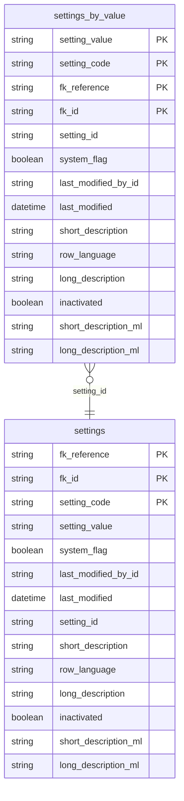

## Diagram 9: Tabs (sandbox, sandbox_details)

- Tables: **2**
- Relationships: **1**

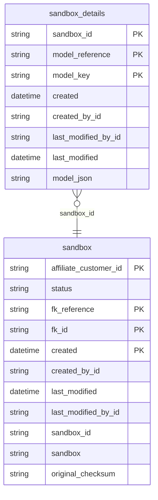

## Diagram 10: Tabs (report_parameters, reports)

- Tables: **2**
- Relationships: **1**

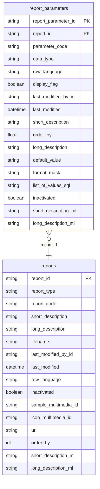

## Diagram 11: Tabs: time_zones

- Tables: **1**
- Relationships: **0**

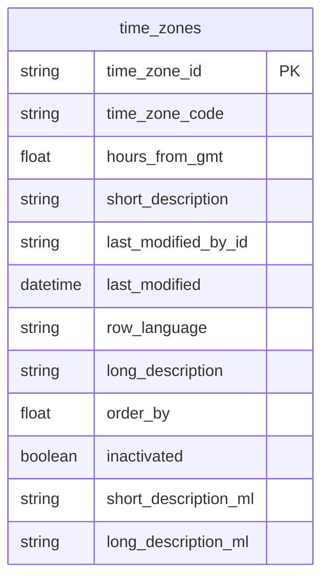

## Diagram 12: Tabs: scope_leases

- Tables: **1**
- Relationships: **0**

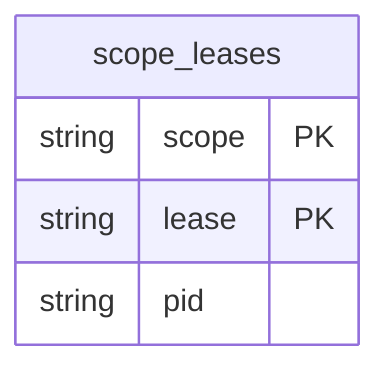

## Diagram 13: Tabs: inventory_restriction_types

- Tables: **1**
- Relationships: **0**

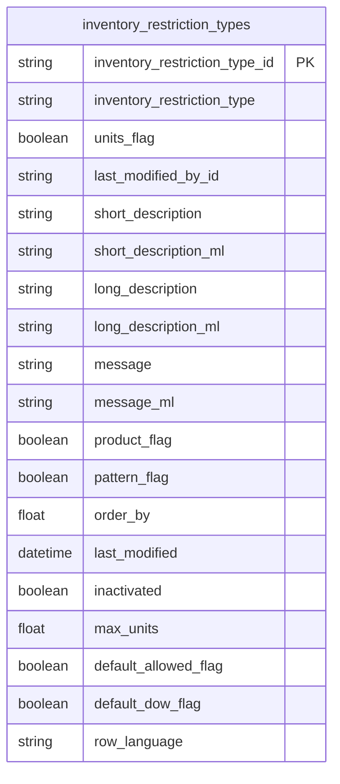

## Diagram 14: Tabs: distributed_cache

- Tables: **1**
- Relationships: **0**

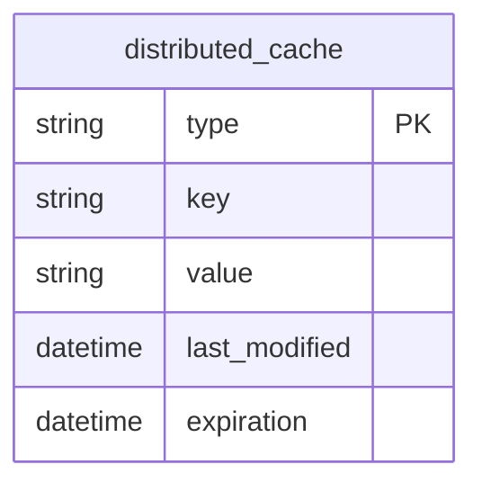

## Diagram 15: Tabs: currencies

- Tables: **1**
- Relationships: **0**

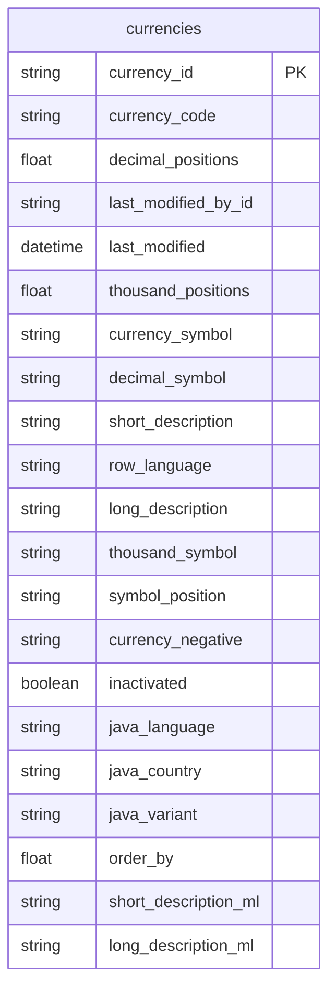

## Diagram 16: Tabs: countries

- Tables: **1**
- Relationships: **0**

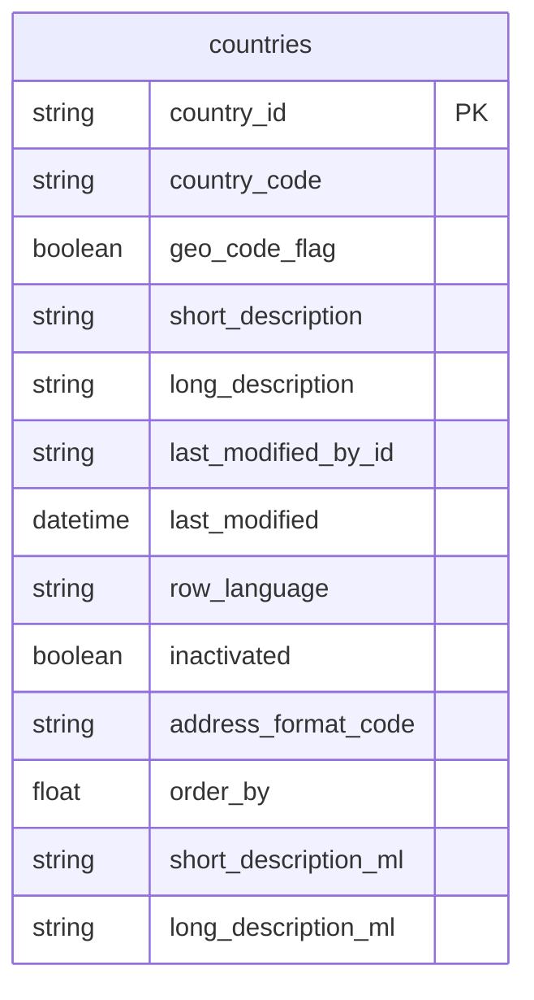

## Diagram 17: Tabs: contact_information

- Tables: **1**
- Relationships: **0**

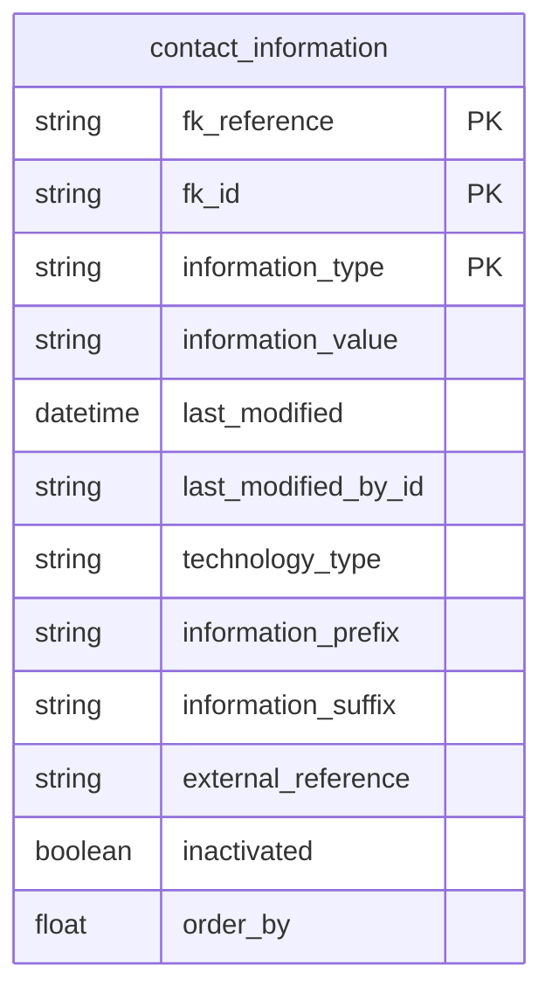

## Diagram 18: Tabs: access_control_list

- Tables: **1**
- Relationships: **0**

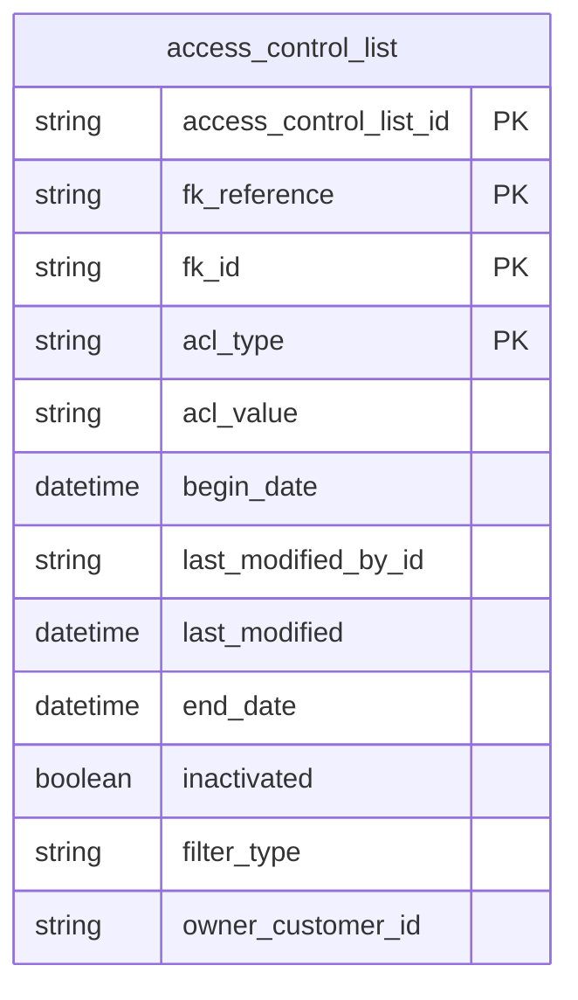
