# Cassandra tables overview

**All tables and materialized views** from `aboveproperty.sql/cassandra/schema/*.cql`, grouped by domain. To refresh, run:

```bash
python3 schema/generate_tables_diagram.py
```

## Diagram

```mermaid
flowchart TB
  %% All tables and materialized views, grouped by domain
  subgraph Addresses_&_Reference["Addresses & Reference"]
    ADDRESSES["ADDRESSES"]
    COMMENTS["COMMENTS"]
    CONTACTS["CONTACTS"]
    CONTACT_INFORMATION["CONTACT_INFORMATION"]
    COUNTRIES["COUNTRIES"]
    CURRENCIES["CURRENCIES"]
    TIME_ZONES["TIME_ZONES"]
    addresses_by_fk["addresses_by_fk"]
    comments_by_comment_id_view_v1__MV_["comments_by_comment_id_view_v1 (MV)"]
    comments_by_fk_view_v1__MV_["comments_by_fk_view_v1 (MV)"]
    contacts_by_customer_id["contacts_by_customer_id"]
    currency_exchange_rates["currency_exchange_rates"]
  end
  subgraph Agreements["Agreements"]
    AGREEMENTS["AGREEMENTS"]
    AGREEMENTS_BY_ACCESS_KEY["AGREEMENTS_BY_ACCESS_KEY"]
    AGREEMENTS_BY_FKID_VIEW_V2__MV_["AGREEMENTS_BY_FKID_VIEW_V2 (MV)"]
    AGREEMENTS_BY_PARENT_ID_VIEW__MV_["AGREEMENTS_BY_PARENT_ID_VIEW (MV)"]
    AGREEMENT_PRICES_V2["AGREEMENT_PRICES_V2"]
    AGREEMENT_XREF["AGREEMENT_XREF"]
  end
  subgraph Alerts["Alerts"]
    ALERTS["ALERTS"]
    alerts_by_customer["alerts_by_customer"]
    alerts_by_customer_by_fk["alerts_by_customer_by_fk"]
    alerts_by_customer_by_type["alerts_by_customer_by_type"]
    alerts_by_marketing_media_id["alerts_by_marketing_media_id"]
    alerts_by_parent["alerts_by_parent"]
    alerts_by_response_value["alerts_by_response_value"]
    alerts_error["alerts_error"]
    alerts_pending["alerts_pending"]
    alerts_pending_task["alerts_pending_task"]
    alerts_process["alerts_process"]
  end
  subgraph Analytics_&_Batch["Analytics & Batch"]
    ANALYTIC_ENTRIES_V2["ANALYTIC_ENTRIES_V2"]
    ANALYTIC_ENTRY_CALENDAR["ANALYTIC_ENTRY_CALENDAR"]
    BATCH_REQUESTS["BATCH_REQUESTS"]
    BATCH_REQUEST_PARAMETERS["BATCH_REQUEST_PARAMETERS"]
    REPORTS["REPORTS"]
    REPORT_PARAMETERS["REPORT_PARAMETERS"]
    batch_requests_by_customer_by_type["batch_requests_by_customer_by_type"]
  end
  subgraph Attributes_&_UDF["Attributes & UDF"]
    ATTRIBUTES["ATTRIBUTES"]
    ATTRIBUTES_BY_CUSTOMER_V2["ATTRIBUTES_BY_CUSTOMER_V2"]
    ATTRIBUTES_BY_CUSTOMER_VIEW__MV_["ATTRIBUTES_BY_CUSTOMER_VIEW (MV)"]
    ATTRIBUTE_TYPES["ATTRIBUTE_TYPES"]
    ATTRIBUTE_TYPE_VALUES_v2["ATTRIBUTE_TYPE_VALUES_v2"]
    UDF_VALID_VALUES["UDF_VALID_VALUES"]
    UDF_VALUES["UDF_VALUES"]
    attribute_types_by_parent_id_view__MV_["attribute_types_by_parent_id_view (MV)"]
    attribute_types_by_type_view__MV_["attribute_types_by_type_view (MV)"]
    attributes_by_fk_reference["attributes_by_fk_reference"]
  end
  subgraph Change_&_Audit["Change & Audit"]
    CHANGE_CALENDAR["CHANGE_CALENDAR"]
    audits_v2["audits_v2"]
    change_requests["change_requests"]
    change_requests_by_change_timestamp["change_requests_by_change_timestamp"]
    message_rejects["message_rejects"]
    message_rejects_by_message_id_view__MV_["message_rejects_by_message_id_view (MV)"]
    message_rejects_by_status_by_affiliate_view__MV_["message_rejects_by_status_by_affiliate_view (MV)"]
    message_traces["message_traces"]
    scope_leases["scope_leases"]
  end
  subgraph Channels["Channels"]
    CHANNELS["CHANNELS"]
    CHANNEL_CONTACTS["CHANNEL_CONTACTS"]
    CHANNEL_CONTENT["CHANNEL_CONTENT"]
    CHANNEL_PARAMETERS["CHANNEL_PARAMETERS"]
    CHANNEL_PARAMETERS_BY_CHANNEL_FK_REFERENCE["CHANNEL_PARAMETERS_BY_CHANNEL_FK_REFERENCE"]
    channel_content_by_channel_content_id["channel_content_by_channel_content_id"]
    channel_parameters_by_channel_fk["channel_parameters_by_channel_fk"]
    channel_parameters_by_channel_parameter_name["channel_parameters_by_channel_parameter_name"]
    channel_parameters_by_customer_id_view__MV_["channel_parameters_by_customer_id_view (MV)"]
    channels_by_channel_code["channels_by_channel_code"]
    channels_by_channel_code_view__MV_["channels_by_channel_code_view (MV)"]
    channels_by_parent_id["channels_by_parent_id"]
    channels_by_parent_id_view__MV_["channels_by_parent_id_view (MV)"]
  end
  subgraph Config_&_Content["Config & Content"]
    ACCESS_CONTROL_LIST["ACCESS_CONTROL_LIST"]
    MULTIMEDIA_RESOURCES["MULTIMEDIA_RESOURCES"]
    MULTIMEDIA_RESOURCES_BY_CUSTOMER_ID_VIEW__MV_["MULTIMEDIA_RESOURCES_BY_CUSTOMER_ID_VIEW (MV)"]
    MULTIMEDIA_RESOURCES_BY_PARENT_ID_VIEW__MV_["MULTIMEDIA_RESOURCES_BY_PARENT_ID_VIEW (MV)"]
    PROGRAMS["PROGRAMS"]
    SETTINGS["SETTINGS"]
    SUBSCRIPTIONS["SUBSCRIPTIONS"]
    SUBSCRIPTION_PRICING["SUBSCRIPTION_PRICING"]
    multimedia_resources_by_parent_id["multimedia_resources_by_parent_id"]
    settings_by_value["settings_by_value"]
    subscription_pricing_by_pricing_code["subscription_pricing_by_pricing_code"]
  end
  subgraph Customers["Customers"]
    CUSTOMERS["CUSTOMERS"]
    CUSTOMER_CREDIT_CARDS["CUSTOMER_CREDIT_CARDS"]
    CUSTOMER_DOMAINS["CUSTOMER_DOMAINS"]
    CUSTOMER_LANGUAGES["CUSTOMER_LANGUAGES"]
    CUSTOMER_MEDIA_SUBSCRIPTIONS["CUSTOMER_MEDIA_SUBSCRIPTIONS"]
    CUSTOMER_SUBSCRIPTIONS["CUSTOMER_SUBSCRIPTIONS"]
    CUSTOMER_XREF["CUSTOMER_XREF"]
    customer_languages_by_customer_id_view__MV_["customer_languages_by_customer_id_view (MV)"]
    customer_map["customer_map"]
    customer_map_version["customer_map_version"]
    customers_by_affiliate_customer_id["customers_by_affiliate_customer_id"]
    customers_by_customer_code["customers_by_customer_code"]
    customers_by_customer_reference["customers_by_customer_reference"]
    customers_by_external_reference["customers_by_external_reference"]
    customers_by_parent_id["customers_by_parent_id"]
    customers_by_references["customers_by_references"]
  end
  subgraph Data_Load_&_Codes["Data Load & Codes"]
    CODES["CODES"]
    CODES_XREF["CODES_XREF"]
    DATA_LOAD_CLASSES["DATA_LOAD_CLASSES"]
    DATA_LOAD_CLASSES_BY_CUSTOMER["DATA_LOAD_CLASSES_BY_CUSTOMER"]
    DATA_LOAD_REJECTS["DATA_LOAD_REJECTS"]
    codes_by_code_type["codes_by_code_type"]
    sandbox["sandbox"]
    sandbox_details["sandbox_details"]
  end
  subgraph Inventory["Inventory"]
    INVENTORY_ALLOTMENTS["INVENTORY_ALLOTMENTS"]
    INVENTORY_ALLOTMENTS_BY_AGREEMENT_ID_V2["INVENTORY_ALLOTMENTS_BY_AGREEMENT_ID_V2"]
    INVENTORY_ALLOTMENT_CALENDAR["INVENTORY_ALLOTMENT_CALENDAR"]
    INVENTORY_ALLOTMENT_RELEASES["INVENTORY_ALLOTMENT_RELEASES"]
    INVENTORY_ALLOTMENT_RELEASES_BY_RELEASE_DATE["INVENTORY_ALLOTMENT_RELEASES_BY_RELEASE_DATE"]
    INVENTORY_REQUESTS["INVENTORY_REQUESTS"]
    INVENTORY_RESTRICTION_TYPES["INVENTORY_RESTRICTION_TYPES"]
    INV_RESTRICTION_REQUESTS["INV_RESTRICTION_REQUESTS"]
    inventory_allotment_calendar_by_customer_by_date["inventory_allotment_calendar_by_customer_by_date"]
    inventory_allotment_calendar_by_customer_id["inventory_allotment_calendar_by_customer_id"]
    inventory_allotments_by_agreement_id_view__MV_["inventory_allotments_by_agreement_id_view (MV)"]
    inventory_allotments_by_customer_id["inventory_allotments_by_customer_id"]
    inventory_consumed_map["inventory_consumed_map"]
    inventory_map["inventory_map"]
    inventory_types["inventory_types"]
  end
  subgraph Invoices_&_Payments["Invoices & Payments"]
    INVOICES["INVOICES"]
    INVOICES_BY_INVOICE_ID["INVOICES_BY_INVOICE_ID"]
    INVOICE_LINES["INVOICE_LINES"]
    INVOICE_ROUTING_TEMPLATES["INVOICE_ROUTING_TEMPLATES"]
    PAYMENTS["PAYMENTS"]
    PAYMENT_APPLICATIONS["PAYMENT_APPLICATIONS"]
    PAYMENT_APPLICATIONS_BY_INVOICE["PAYMENT_APPLICATIONS_BY_INVOICE"]
    invoice_lines_by_billing_customer_by_date["invoice_lines_by_billing_customer_by_date"]
    invoice_lines_by_external_reference["invoice_lines_by_external_reference"]
    payments_by_customer_by_business_date["payments_by_customer_by_business_date"]
    payments_by_payment_id["payments_by_payment_id"]
    payments_schedule["payments_schedule"]
  end
  subgraph Ledger_&_System["Ledger & System"]
    GENERAL_LEDGER_ACCOUNTS["GENERAL_LEDGER_ACCOUNTS"]
    GENERAL_LEDGER_TRX["GENERAL_LEDGER_TRX"]
    delivery_queue["delivery_queue"]
    distributed_cache["distributed_cache"]
    general_ledger_trx_by_batch_request["general_ledger_trx_by_batch_request"]
    general_ledger_trx_by_fkid["general_ledger_trx_by_fkid"]
  end
  subgraph Marketing["Marketing"]
    MARKETING_CAMPAIGNS["MARKETING_CAMPAIGNS"]
    MARKETING_CAMPAIGNS_BY_MARKETING_CAMPAIGN_ID_V2__MV_["MARKETING_CAMPAIGNS_BY_MARKETING_CAMPAIGN_ID_V2 (MV)"]
    MARKETING_CAMPAIGN_CONTACTS["MARKETING_CAMPAIGN_CONTACTS"]
    MARKETING_CAMPAIGN_FILTERS["MARKETING_CAMPAIGN_FILTERS"]
    MARKETING_CAMPAIGN_RESPONSES["MARKETING_CAMPAIGN_RESPONSES"]
    MARKETING_MEDIA["MARKETING_MEDIA"]
    MARKETING_MEDIA_CALENDAR["MARKETING_MEDIA_CALENDAR"]
    MARKETING_MEDIA_KEYWORDS["MARKETING_MEDIA_KEYWORDS"]
    MKT_MEDIA_CALENDAR_REQUESTS["MKT_MEDIA_CALENDAR_REQUESTS"]
    MMEDIA_CALENDAR_IMPRESSIONS["MMEDIA_CALENDAR_IMPRESSIONS"]
    MMEDIA_CAL_IMPRESSION_TOTALS["MMEDIA_CAL_IMPRESSION_TOTALS"]
    marketing_media_by_customer_id["marketing_media_by_customer_id"]
    marketing_media_by_parent_id["marketing_media_by_parent_id"]
  end
  subgraph Pricing_&_Products["Pricing & Products"]
    PRICES["PRICES"]
    PRICES_BY_CUSTOMER_BY_EXTERNAL_REFERENCE["PRICES_BY_CUSTOMER_BY_EXTERNAL_REFERENCE"]
    PRICES_BY_CUSTOMER_ID_VIEW_v5__MV_["PRICES_BY_CUSTOMER_ID_VIEW_v5 (MV)"]
    PRICES_BY_PARENT_ID_VIEW_v5__MV_["PRICES_BY_PARENT_ID_VIEW_v5 (MV)"]
    PRICE_ADJUSTMENT_CALENDAR["PRICE_ADJUSTMENT_CALENDAR"]
    PRICE_ADJUSTMENT_CALENDAR_V2["PRICE_ADJUSTMENT_CALENDAR_V2"]
    PRICE_ADJUSTMENT_REQUESTS["PRICE_ADJUSTMENT_REQUESTS"]
    PRICE_ASSEMBLIES["PRICE_ASSEMBLIES"]
    PRICE_CALENDAR["PRICE_CALENDAR"]
    PRICE_CALENDAR_REQUESTS["PRICE_CALENDAR_REQUESTS"]
    PRICE_CREDIT_CARDS["PRICE_CREDIT_CARDS"]
    PRICE_PRODUCTS["PRICE_PRODUCTS"]
    PRODUCTS["PRODUCTS"]
    PRODUCTS_BY_CUSTOMER_BY_EXTERNAL_REFERENCE["PRODUCTS_BY_CUSTOMER_BY_EXTERNAL_REFERENCE"]
    PRODUCTS_BY_CUSTOMER_ID_VIEW_v5__MV_["PRODUCTS_BY_CUSTOMER_ID_VIEW_v5 (MV)"]
    PRODUCTS_BY_PARENT_ID_VIEW_v5__MV_["PRODUCTS_BY_PARENT_ID_VIEW_v5 (MV)"]
    PRODUCT_ASSEMBLIES["PRODUCT_ASSEMBLIES"]
    PRODUCT_EXCEPTIONS["PRODUCT_EXCEPTIONS"]
    PRODUCT_INV_RESTRICTIONS["PRODUCT_INV_RESTRICTIONS"]
    PRODUCT_TEMPLATES["PRODUCT_TEMPLATES"]
    REVENUE_MGMT_CALENDAR["REVENUE_MGMT_CALENDAR"]
    REVENUE_MGMT_REQUESTS["REVENUE_MGMT_REQUESTS"]
    price_map["price_map"]
    price_products_by_price_product_id["price_products_by_price_product_id"]
    product_customers["product_customers"]
    product_customers_by_product["product_customers_by_product"]
  end
  subgraph Reservations["Reservations"]
    RESERVATIONS["RESERVATIONS"]
    RESERVATIONS_HISTORY["RESERVATIONS_HISTORY"]
    RESERVATIONS_MAP_BY_EXPIRATION_DATE["RESERVATIONS_MAP_BY_EXPIRATION_DATE"]
    RESERVATION_AUTHORIZATIONS["RESERVATION_AUTHORIZATIONS"]
    RESERVATION_COMMENTS["RESERVATION_COMMENTS"]
    RESERVATION_DOCUMENTS["RESERVATION_DOCUMENTS"]
    RESERVATION_PARTIES["RESERVATION_PARTIES"]
    RESERVATION_PRODUCT_CALENDAR_BY_CUSTOMER_BY_DATE["RESERVATION_PRODUCT_CALENDAR_BY_CUSTOMER_BY_DATE"]
    reservation_rules["reservation_rules"]
    reservations_map["reservations_map"]
    reservations_map_by_cancel_no["reservations_map_by_cancel_no"]
    reservations_map_by_destination_customer_id["reservations_map_by_destination_customer_id"]
    reservations_map_by_external_cancel_no["reservations_map_by_external_cancel_no"]
    reservations_map_by_external_reservation_number["reservations_map_by_external_reservation_number"]
    reservations_map_by_parent_id["reservations_map_by_parent_id"]
    reservations_map_by_property_level_reference["reservations_map_by_property_level_reference"]
    reservations_map_by_reservation_number["reservations_map_by_reservation_number"]
    reservations_map_by_session_id["reservations_map_by_session_id"]
    reservations_map_product_id["reservations_map_product_id"]
  end
  subgraph Rules["Rules"]
    RULES["RULES"]
    RULE_CALENDAR["RULE_CALENDAR"]
    RULE_CALENDAR_REQUESTS["RULE_CALENDAR_REQUESTS"]
    RULE_XREF["RULE_XREF"]
    rules_by_customer_id["rules_by_customer_id"]
    rules_by_unique_scope_reference["rules_by_unique_scope_reference"]
  end
  subgraph Users_&_Security["Users & Security"]
    PERMISSIONS["PERMISSIONS"]
    SECURITY_ROLES["SECURITY_ROLES"]
    SECURITY_ROLE_PERMISSIONS["SECURITY_ROLE_PERMISSIONS"]
    SECURITY_ROLE_PERMISSIONS_BY_CUSTOMER["SECURITY_ROLE_PERMISSIONS_BY_CUSTOMER"]
    SECURITY_ROLE_PERMISSIONS_BY_ROLE["SECURITY_ROLE_PERMISSIONS_BY_ROLE"]
    SESSIONS["SESSIONS"]
    SESSIONS_BY_SESSION_ID__MV_["SESSIONS_BY_SESSION_ID (MV)"]
    SESSION_CHECKPOINTS["SESSION_CHECKPOINTS"]
    SESSION_HISTORY["SESSION_HISTORY"]
    USERS["USERS"]
    USER_DEFINED_FIELDS["USER_DEFINED_FIELDS"]
    USER_SECURITY_ROLES_BY_CUSTOMER__MV_["USER_SECURITY_ROLES_BY_CUSTOMER (MV)"]
    USER_SECURITY_ROLES_V2["USER_SECURITY_ROLES_V2"]
    USER_SECURITY_ROLES_V3["USER_SECURITY_ROLES_V3"]
    device_token_by_user_id["device_token_by_user_id"]
    permissions_by_parent_id_view_v2__MV_["permissions_by_parent_id_view_v2 (MV)"]
    permissions_by_reference_view_v2__MV_["permissions_by_reference_view_v2 (MV)"]
    sessions_by_user_id["sessions_by_user_id"]
    sessions_by_user_last_login["sessions_by_user_last_login"]
    users_by_customer["users_by_customer"]
    users_by_email["users_by_email"]
    users_by_username["users_by_username"]
  end
  subgraph Workflow["Workflow"]
    WORKFLOW_TASKS["WORKFLOW_TASKS"]
    WORKFLOW_TASK_CATEGORIES["WORKFLOW_TASK_CATEGORIES"]
    workflow_tasks_by_customer_by_category["workflow_tasks_by_customer_by_category"]
    workflow_tasks_by_customer_by_due_date["workflow_tasks_by_customer_by_due_date"]
    workflow_tasks_by_customer_reference_date["workflow_tasks_by_customer_reference_date"]
    workflow_tasks_by_fk_reference["workflow_tasks_by_fk_reference"]
    workflow_tasks_by_parent_id["workflow_tasks_by_parent_id"]
  end
```


